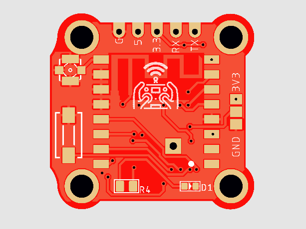
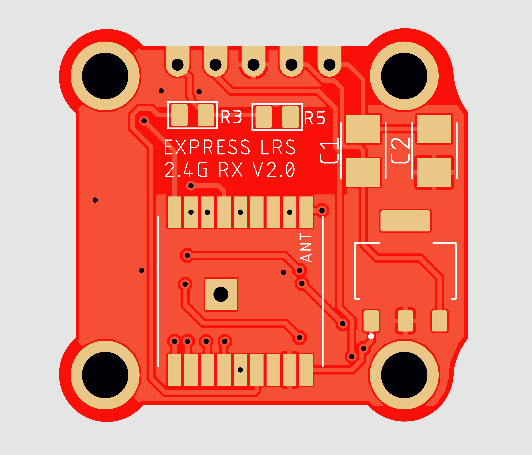
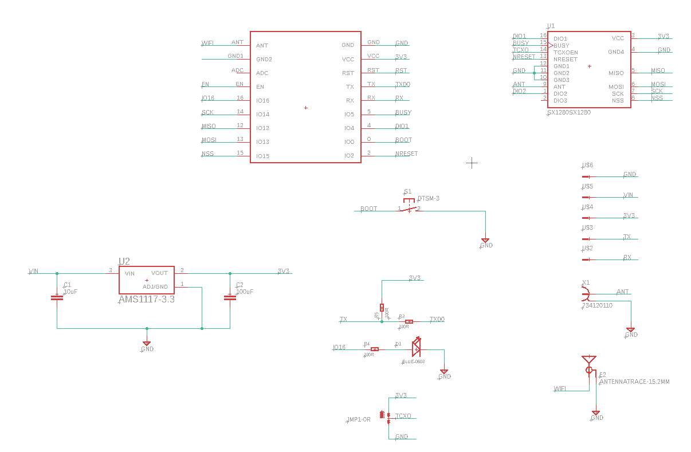

# 20x20 2.4G RX PCB

### PCB manufacturing

Upload the Gerber file to https://jlcpcb.com/RAT.  Check the price for 5, 10, and 30 pieces.  It is sometimes cheaper to order 30 than 10 and only a minor increase in price compared to 5.

*PCB Thickness: 1mm*

### BOM

- SX1280 Wireless module 2.4G https://www.aliexpress.com/item/32946774361.html
- AMS1117 3.3 Power Reg https://www.aliexpress.com/item/32910803907.html
- ESP-01F https://www.aliexpress.com/item/32921798906.html
- C1 3528 10uF Tantalum Capacitor
- C2 3528 47uF Tantalum Capacitor
- R1 0805 10K Resistor
- R2 0805 10K Resistor
- R3 0805 330R Resistor
- R4 0805 270R Resistor
- 0603 LED
- u.fl connector https://www.aliexpress.com/item/33059352910.html
- Button https://www.ebay.com.au/itm/10pcs-3-6-2-5mm-Tactile-Push-Button-Switch-Tact-Switch-Micro-Switch-2-Pin-SMD/282930653324?hash=item41dffb288c:g:IEoAAOSwyi1a19WD

### Build order

- Solder the ESP-01F module.
- Solder C1 and C2
- Solder the reg
- Solder the 10K resistors
- Flip the PCB and solder the ground pad under the ESP from the other side
- Solder the SX1280
- Solder R4 and the LED
- Solder the u.fl and button
- Bridge the solder jumper centre pin to either 3v3 (if you have a TCXO 1280 module), or GND (if you have a non-TCXO 1280 module)

### Schematic and PCB layout

  

### Flashing 

- Connect an FTDI to the GND, 5v, TX and RX pins on the header, then hold the boot button while powering up, and flash the DIY_2400_RX_ESP8285_SX1280_via_UART build in pio