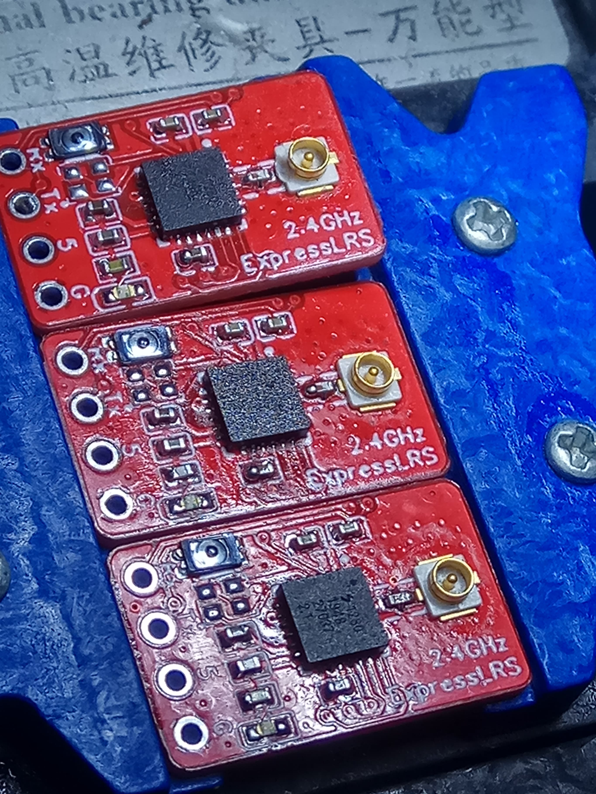

v1.0 PCB
- Pictured below

v1.1 PCB
- Lager IPEX pads
- Added boot jumper pads under the button and base of the PCB.  These can be used in place of the button.  Any solder paste applied to these pads via a stencil will need to be removed before adding a button.

v1.2 PCB
- Lager XO footprint for the FL520WFMT1.
- Remove ground form beneath the UFL.

# Nano 2.4 GHz Rx

The ExLRS Nano Rx is 18mm*11mm and uses the same pinout as the CRSF Nano.  This allows for direct mounting to compatible flight controllers.

This PCB uses 0402 SMD components and will require a hot air rework station, plus a microscope to make life easier.

Here is the EasyEDA project containing schematics and PCB design.
https://easyeda.com/jyesmith/expresslrs-rx_copy_copy

A build video of the front side.
https://youtu.be/33BSITaKFUY

 

### PCB manufacturing

Upload the Gerber file to https://jlcpcb.com/ and below are the order options.  Red is clearly the only acceptable colour! It is recommended to also get a solder paste stencil, and check the price for 5, 10, and 30 pieces.  It is sometimes cheaper to order 30 than 10 and only a minor increase in price compared to 5.

 

### BOM

Below are links to the more uncommon components.

- 3.3V regulator https://au.mouser.com/ProductDetail/microchip/mic5319-33yd5-tr/?qs=U6T8BxXiZAVXDFAtjOExZg%3D%3D
- ESP01 https://www.aliexpress.com/item/32957577407.html
- Button https://au.mouser.com/ProductDetail/alps/sktaaae010/?qs=u4fy%2FsgLU9NVRRqWeykmWg%3D%3D
- sx1280 https://au.mouser.com/ProductDetail/semtech/sx1280imltrt/?qs=5aG0NVq1C4xuoq8G6ZzdxQ%3D%3D
- RF output filter https://au.mouser.com/ProductDetail/johanson/2450fm07d0034t/?qs=%252bEew9%252b0nqrBEY7VUloPs4Q%3D%3D
- Crystal.  If the FW520WFMT1 is out of stock, the FL520WFMT1 can be used. The FL is slightly larger and may require more skill to solder but it's been used before.  The v1.2 PCB is designed for this larger footprint.
  - FW520WFMT1 https://au.mouser.com/ProductDetail/Diodes-Incorporated/FW520WFMT1?qs=%2Fha2pyFadugPDf0nhgewaMwLjNbxaY4Xr5XmslnYeZgOQCJm3ZvVpQ%3D%3D or https://www.digikey.com/product-detail/en/diodes-incorporated/FW520WFMT1/FW520WFMT1CT-ND/6173706
  - FL520WFMT1 https://www.digikey.com/en/products/detail/diodes-incorporated/FL520WFMT1/6173685?s=N4IgTCBcDaIGIBkCsYAMB1OBZAKgRhAF0BfIA

### Antennas

The antennas linked below when cut to an end-to-end length of 49.8mm will be tunned for the middle of the 2.4GHz range.  Ideally confirm this with a vector analyser.

https://www.aliexpress.com/item/4000197347021.html

https://youtu.be/bOKTOFyyGHo

 

### Build layout cheat sheet

I made the below image as a quick reference to help when placing components.

