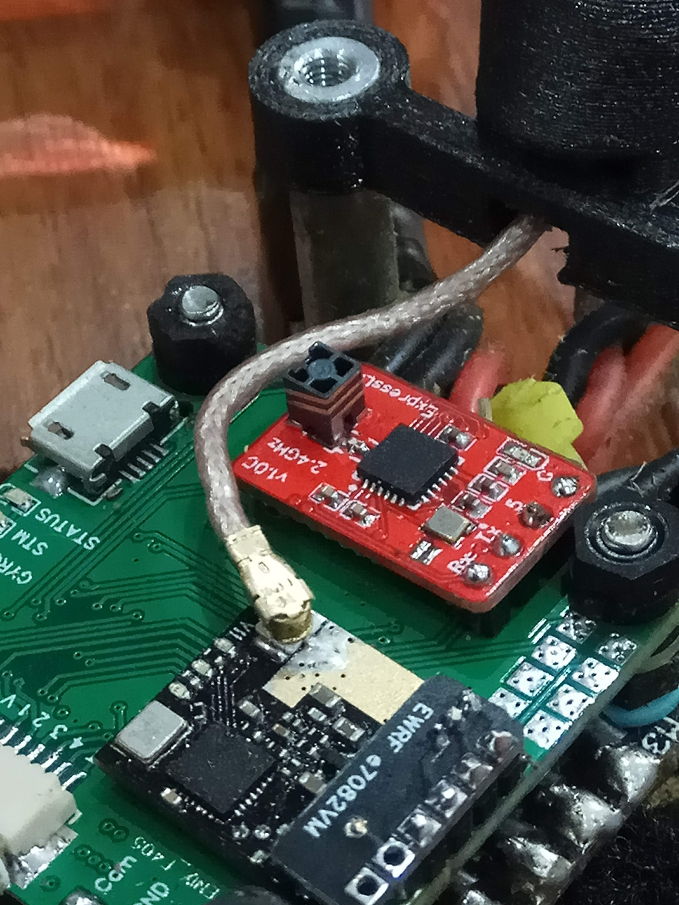

v1.1 PCB
- Lager XO footprint for the FL520WFMT1.
- Remove ground form beneath the UFL.

This is pretty much the same as the normal Nano Rx with a different antenna.  So please make sure you check out its readme.  The button has been removed and jumper pads left in its place for the initial flashing.

Shout out to FireNWater and JamesK for getting the ball rolling with chip antennas.

- Antenna https://www.digikey.com.au/products/en?keywords=%20WM4893CT-ND

Demo video comparing it against a tuned dipole.
https://youtu.be/CnaEe7YZB-Q

