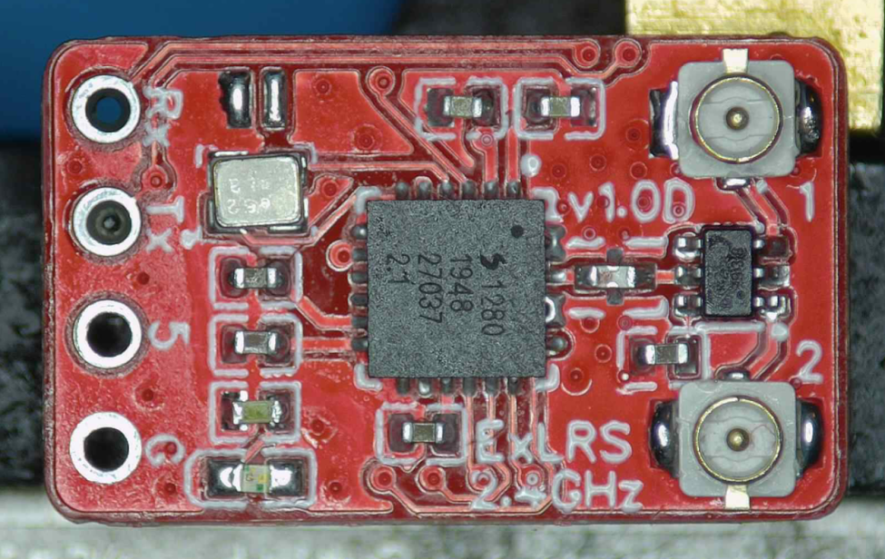
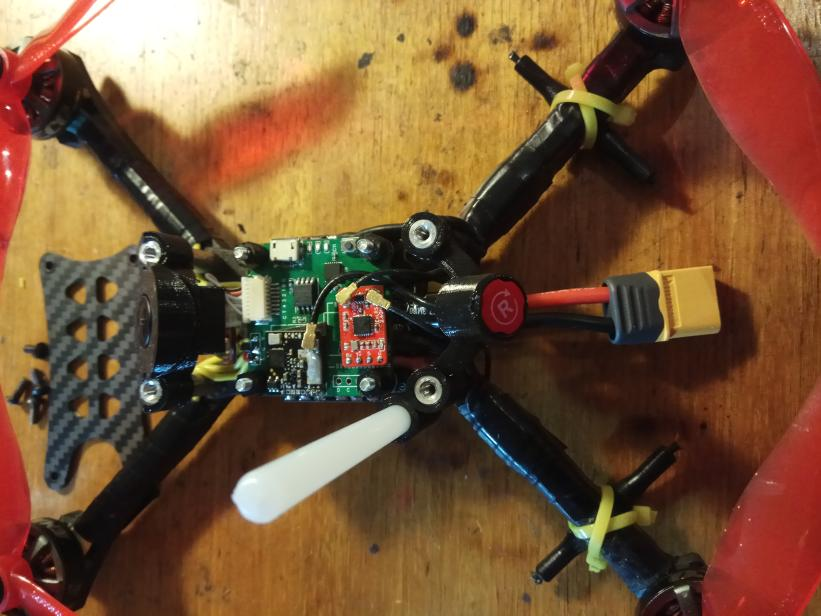

v1.1 PCB
- Lager XO footprint for the FL520WFMT1.
- Remove ground form beneath the UFL.

This is pretty much the same as the normal Nano Rx with the addition of a RF switch. So please make sure you check out its readme. The button has been removed and jumper pads left in its place for the initial flashing.  Upload the standard 2.4 Nano Rx targte with -DUSE_DIVERSITY uncommented.

Shout out to StonedDawg and JamesK for getting the ball rolling with chip antennas.

- RF Switch https://www.digikey.com.au/product-detail/en/psemi/4259-63/1046-1011-1-ND/2614515
- Datasheet https://www.psemi.com/pdf/datasheets/pe4259ds.pdf

Test video https://youtu.be/M2NWUPNDDI8

 
