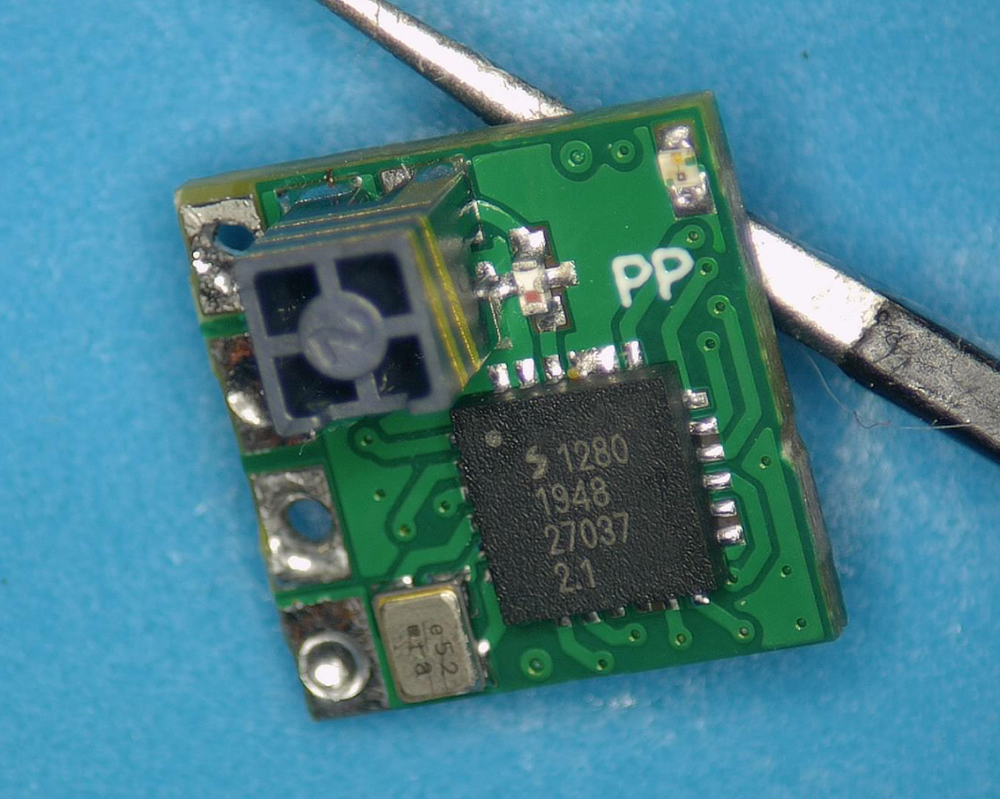
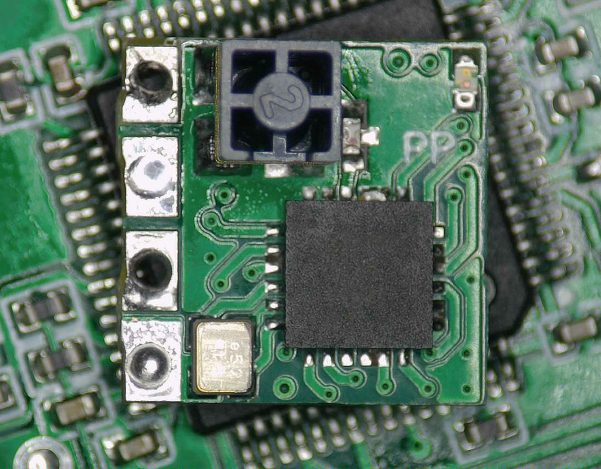
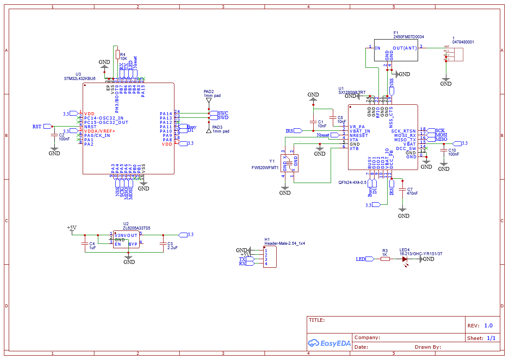
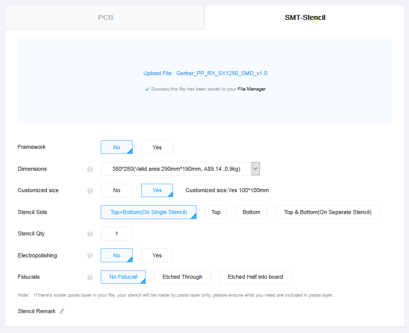
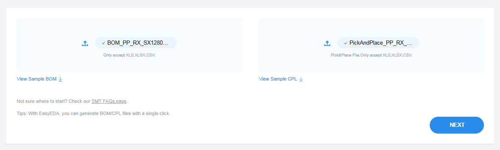
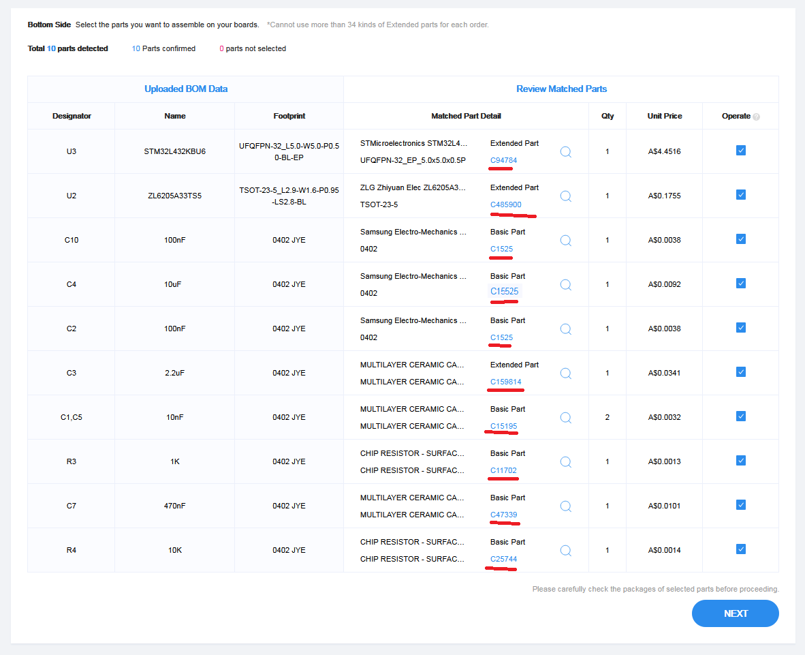
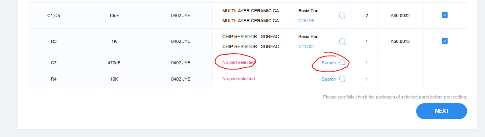
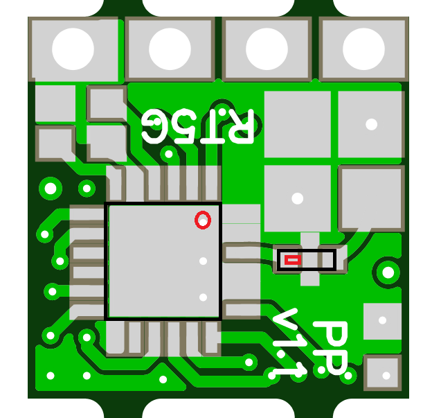

# PP 2.4 GHz Rx

This rx is a remix of the RX_CCG_Nano, so credit to @juhtipuhti for the initial design.

The PP is a 10 x 10mm rx with a chip antenna and weighs in at 0.42g!

The base of the PCB can be assembled by JLC, leaving you only 5 components on the top to place.  It is recommended to also order a stencil for solder paste.  A hot air station is required.

A build video of the top side. https://youtu.be/LP0_UdjuBik

https://easyeda.com/jyesmith/ccg-pico-ceramic_copy

  

### PCB and Stencil Order

Upload the Gerber file to https://cart.jlcpcb.com/quote and below are the order options.  You will need to do a separate order for the stencil.  If you decrease the PCB Qty to 5 you will be given the addition option to have all 5 or only 2 PCB assembled under SMT Assembly.

 

Upload the BOM and PickAndPlace files.

Confirm the selected components.  If you get a red 'No part selected' warning, press Search and search by part number (its starts with a C) and select the 0402 size.

 

The final review will probably looks wrong and with components rotated incorrectly.  This appears to be normal and production will still be ok.  To date I have had good communication with JLC if there are production issues and they get in contact before starting.

### BOM

#### Mouser
- sx1280 https://au.mouser.com/ProductDetail/semtech/sx1280imltrt/?qs=5aG0NVq1C4xuoq8G6ZzdxQ%3D%3D
- RF output filter https://au.mouser.com/ProductDetail/johanson/2450fm07d0034t/?qs=%252bEew9%252b0nqrBEY7VUloPs4Q%3D%3D
- FW520WFMT1 https://au.mouser.com/ProductDetail/Diodes-Incorporated/FW520WFMT1?qs=%2Fha2pyFadugPDf0nhgewaMwLjNbxaY4Xr5XmslnYeZgOQCJm3ZvVpQ%3D%3D
- Antenna https://au.mouser.com/ProductDetail/Molex/47948-0001/?qs=VBGyBZiQP4FMDCbO62oZvg%3D%3D
- 0603 LED, there are a lot of options to choose from and you can select another colour.  Or use your hot air gun to remove an led from a dead gear. https://au.mouser.com/ProductDetail/Wurth-Elektronik/150060AS75000/?qs=d0WKAl%252BL4KbvMBYryeof0Q%3D%3D

#### Or

#### Digikey
- sx1280 https://www.digikey.com.au/product-detail/en/semtech-corporation/SX1280IMLTRT/SX1280IMLTRTCT-ND/7203799
- RF output filter https://www.digikey.com.au/product-detail/en/johanson-technology-inc/2450FM07D0034T/712-1654-1-ND/9477825
- FW520WFMT1 https://www.digikey.com/product-detail/en/diodes-incorporated/FW520WFMT1/FW520WFMT1CT-ND/6173706
- Antenna https://www.digikey.com.au/products/en?keywords=%20WM4893CT-ND
- 0603 LED, there are a lot of options to choose from and you can select another colour.  Or use your hot air gun to remove an led from a dead gear. https://www.digikey.com.au/product-detail/en/w%C3%BCrth-elektronik/150060AS75000/732-150060AS75000CT-ND/10468330

### Build layout cheat sheet

- FW520WFMT1 has no orientation.  Just have the longest dimension left to right.
- sx1280 the dot is in the top right
- RF output filter red dot to the left
- LED, ground (cathode) is the upper pad
- Antenna the build video has details at 16:40 https://youtu.be/LP0_UdjuBik?t=1001

### Flashing

The first flash will requie connecting a st link to SWCLK, SWDIO, 5V and GND.  After this it can be updated through Betaflight passthrough.  Flash the DIY_2400_RX_STM32_CCG_Nano_v0_5_via_STLINK and DIY_2400_RX_STM32_CCG_Nano_v0_5_via_BetaflightPassthrough targets.

