# 2.4GHz Minimal Tx

Very Small 2.4GHz eLRS Module to fit INTO the Jumper T-Lite or other Transmitters.

### PCB manufacturing

Upload the Gerber file to https://jlcpcb.com/RAT.  Check the price for 5, 10, and 30 pieces.  It is sometimes cheaper to order 30 than 10 and only a minor increase in price compared to 5.

*PCB Thickness: 1mm*

### BOM

- E28-2G4M27S SX1280 Wireless module 2.4G 27dBm https://www.aliexpress.com/item/33004335921.html
- Pololu 3.3V Step-Up/Step-Down Voltage Regulator S7V8F3 https://www.pololu.com/product/2122
- 10k 0805 resistor https://www.aliexpress.com/item/4000049692396.html
- SMA or RPSMA right angle pigtail 15cm https://www.aliexpress.com/item/5-Pieces-SMA-Female-Jack-Right-Angle-To-Ufl-IPX-IPEX-u-fl-Coax-1-13mm/4001176578251.html
- WROOM32 module https://www.aliexpress.com/item/ESP32-ESP-32S-WIFI-Bluetooth-Module-240MHz-Dual-Core-CPU-MCU-Wireless-Network-Board-ESP-WROOM/4000230070560.html
- 10uF 3528 Cap https://www.aliexpress.com/item/32666405364.html?algo_pvid=365ae59d-9e6c-46b7-9792-2656b0961f70&algo_expid=365ae59d-9e6c-46b7-9792-2656b0961f70-6&btsid=0bb0623116027669252885518ea610&ws_ab_test=searchweb0_0,searchweb201602_,searchweb201603_

### Build order

- Solder the WROOM32 module
- Solder the 10k resistor
- Solder the capacitor
- Flash firmware to the Module to see if the ESP32 works fine.
- Solder the e28 module. Dont forget to change the zero ohm resistor near the ufl.  Default is to use the PCB antenna, it must be repositioned to use the ufl.
- Connect GND and 3,3 from the modules 3-pin header to the S7V8F3 regulators GND and VOUT.
- Connect GND and VIN from the regulator and SP from the module to the modul-bay connector of the Jumper T-Lite.

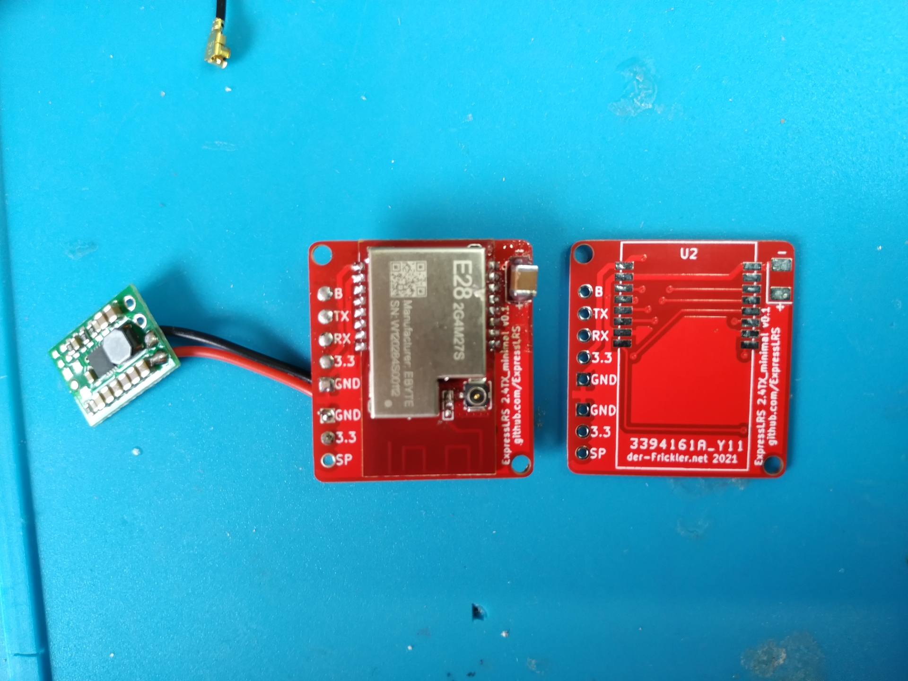 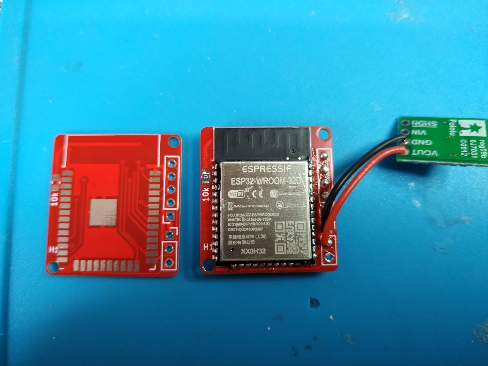 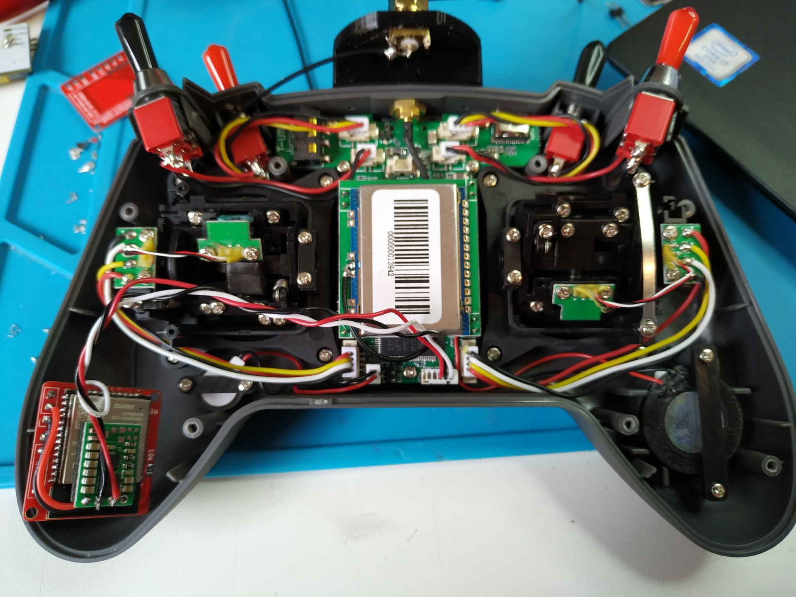

Alternatively it might be possible to connect SHDN from the regulator to the module bays VOUT and VIN from the regulator directly to the battery + side. So the regulator is powered directly by the battery, but only enabled if the module is selected by OpenTX. By doing this you will be able to draw more current for running the module at higher output power, but it might drain the battery over very long time even if the remote is shut down. But this option needs some more investigation, i guess the pullup on the SHDN pin needs to be removed and maybe replaced by a pulldown. 

**Please check the temperature of the module, i added a small heatsink to both sides (ESP32 and SX1280 module) i had lying around from my raspberry pi - just to be on the save side.**

### STLs

- Print the 2nd Antenna Mount for the Jumper T-Lite.

### Build Pics

 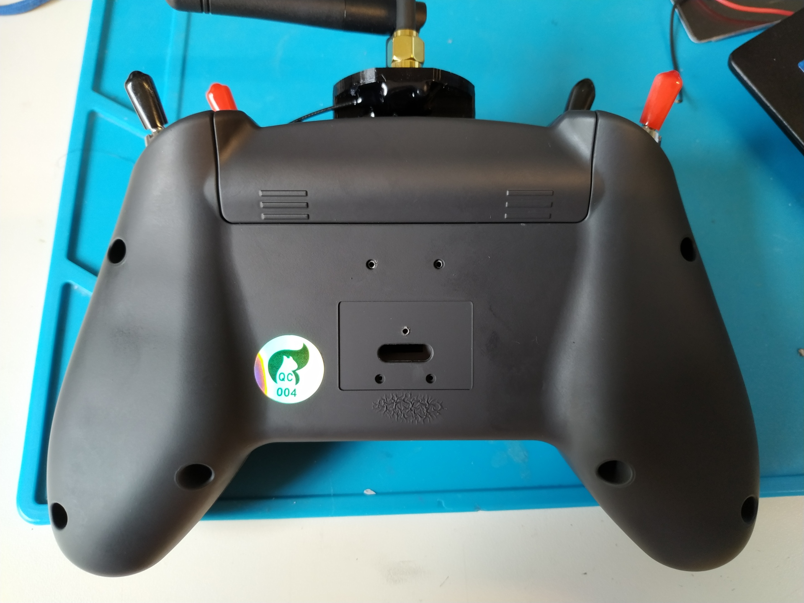 
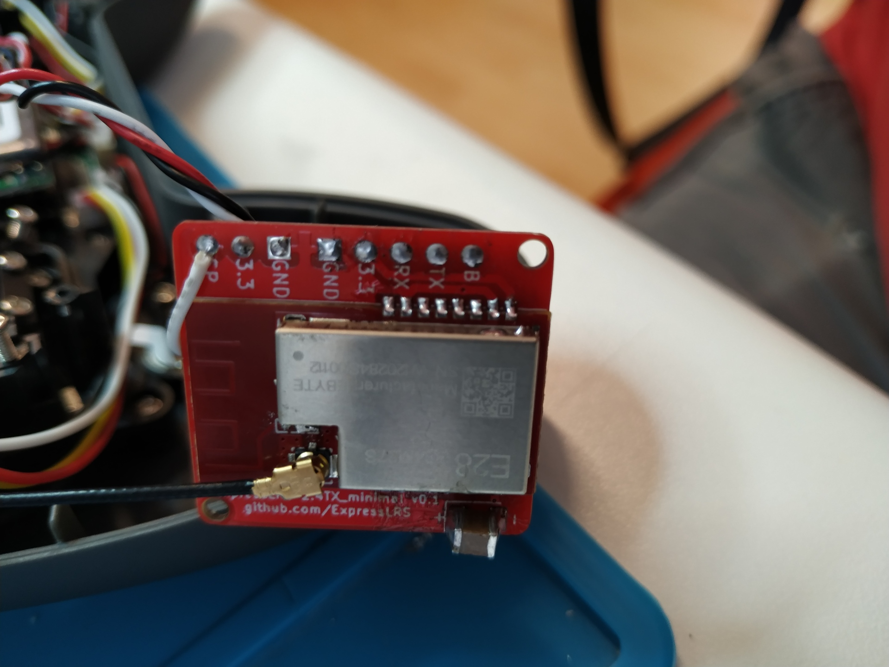 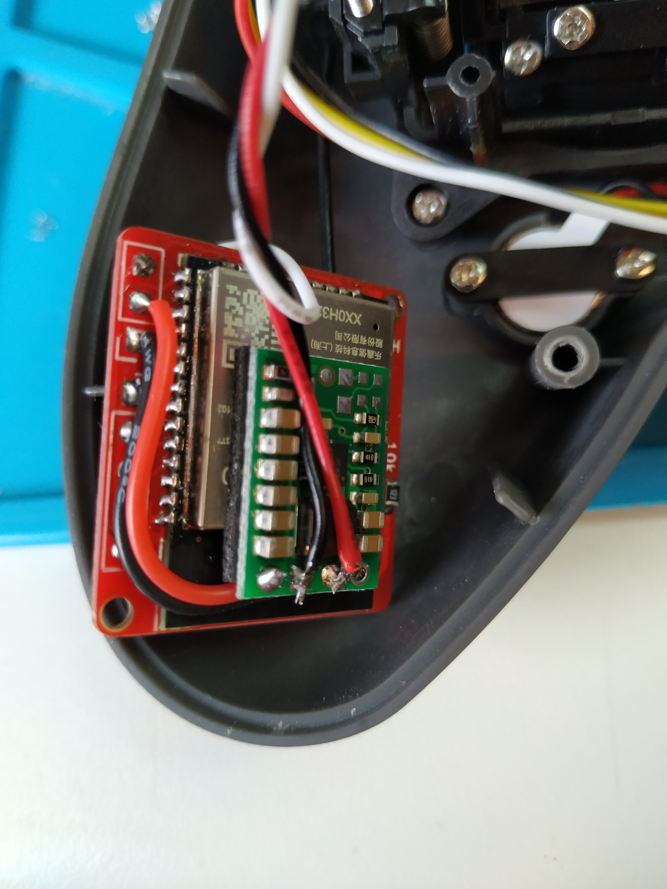 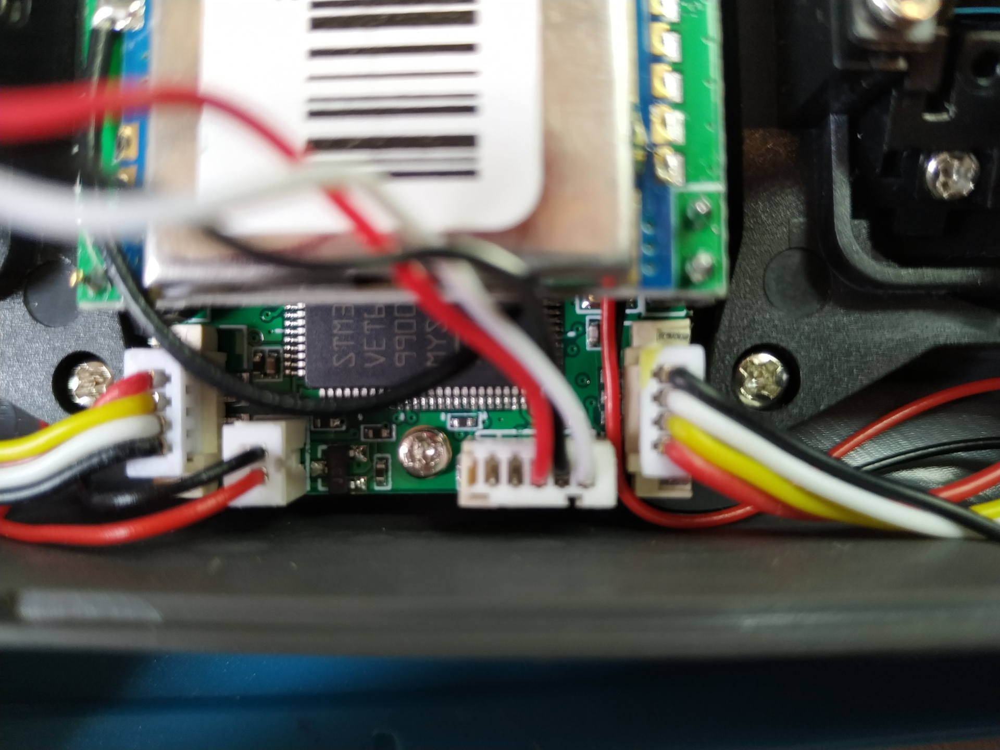
  
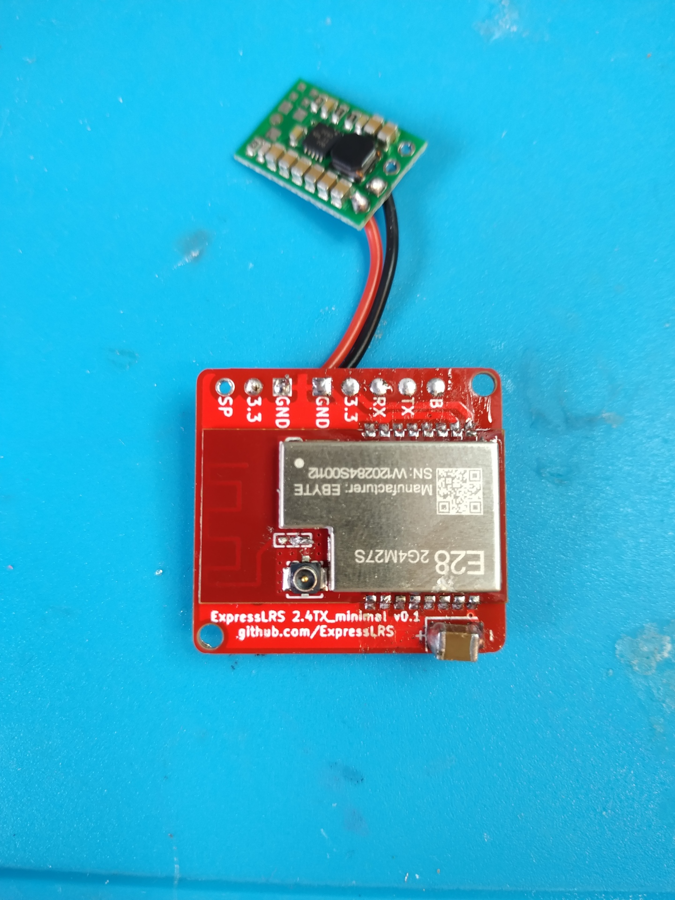 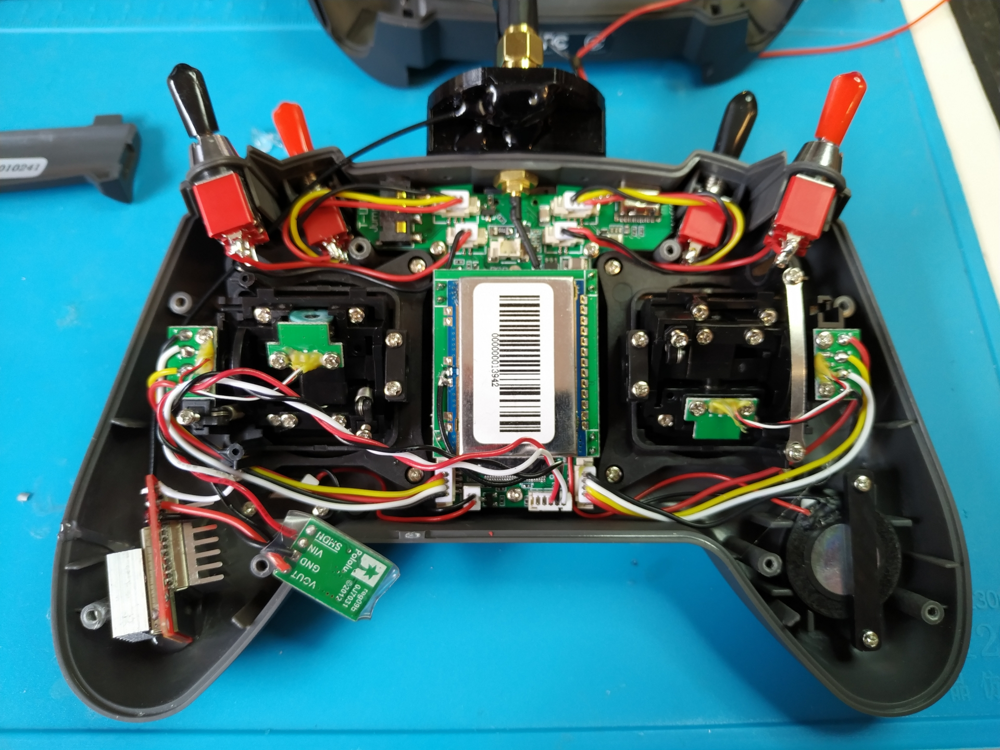 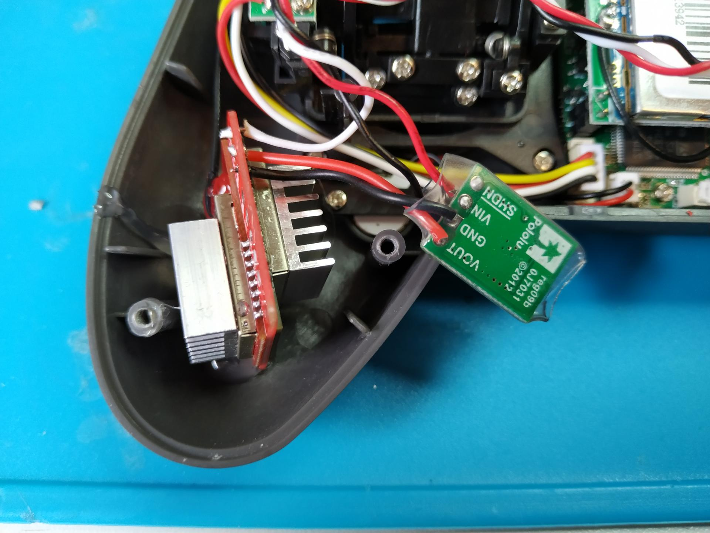
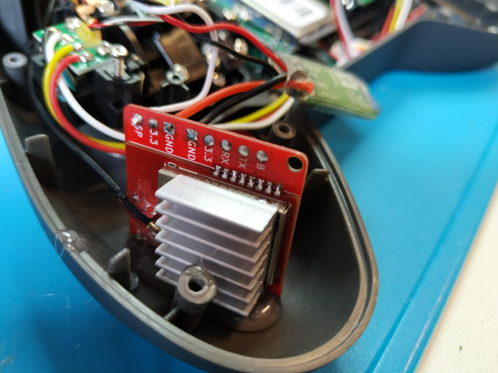 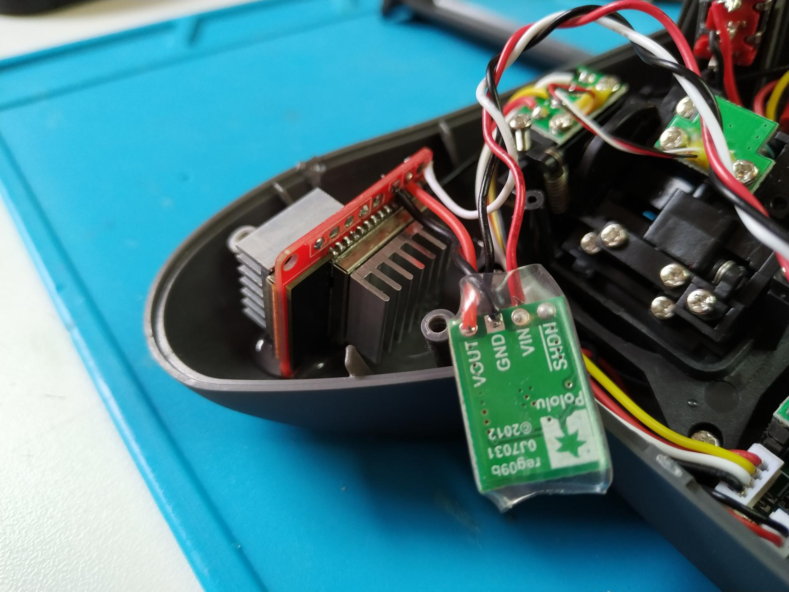 

### Schematic and PCB layout

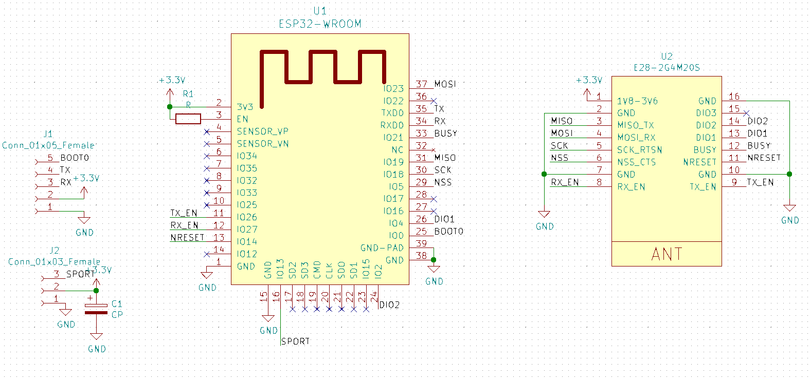
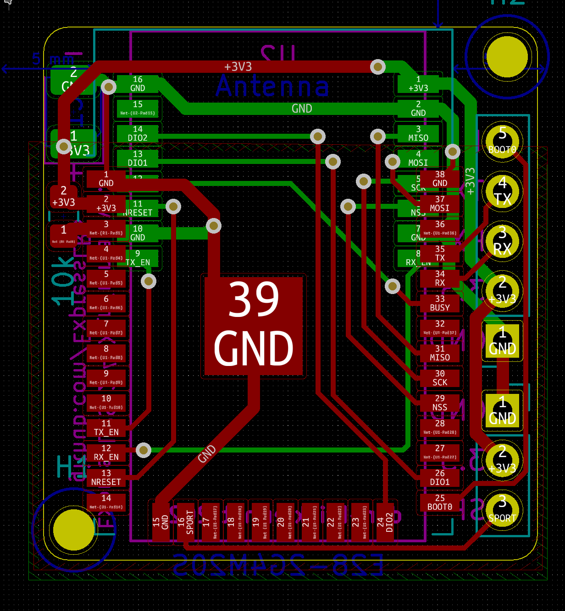

### Flashing 

- Connect an FTDI to the GND=GND, 3.3=3,3V, TX=RX, RX=TX, B=GND pins on the left header and flash the DIY_2400_TX_ESP32_SX1280_E28_via_UART build in pio/eLRS Configurator

