# 2.4GHz Slimmer Tx Lite or JR Case

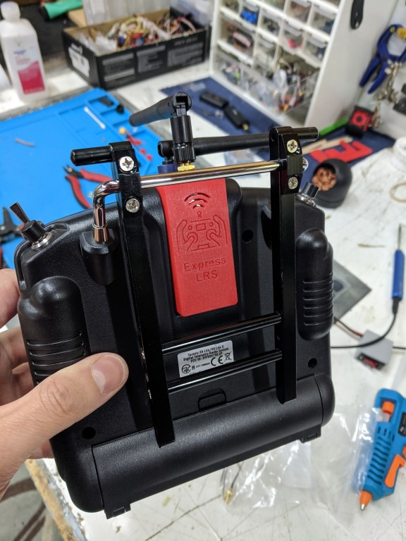    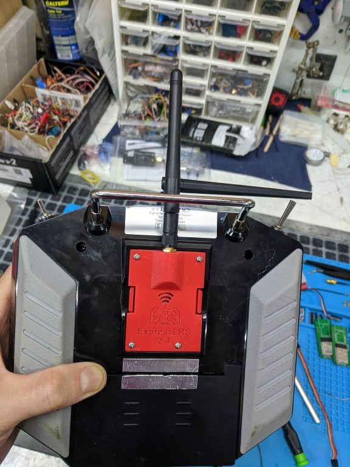

EasyEda Link: https://easyeda.com/jberkmanPI/tx-slim-2-4g-sch

### PCB manufacturing

This is copied from the slim board page.

Upload the Gerber file to https://jlcpcb.com/RAT.  Check the price for 5, 10, and 30 pieces.  It is sometimes cheaper to order 30 than 10 and only a minor increase in price compared to 5.

*PCB Thickness: 1mm*

### BOM

- E28-2G4M27S SX1280 Wireless module 2.4G 27dBm https://www.aliexpress.com/item/33004335921.html
- 3.3V DC-DC Step Down Power Supply https://www.aliexpress.com/item/32880983608.html
- 10k 0805 resistor https://www.aliexpress.com/item/4000049692396.html
- SMA or RPSMA connector https://www.aliexpress.com/item/4000848776660.html https://www.aliexpress.com/item/4000848776660.html
- WROOM32 module https://www.aliexpress.com/item/ESP32-ESP-32S-WIFI-Bluetooth-Module-240MHz-Dual-Core-CPU-MCU-Wireless-Network-Board-ESP-WROOM/4000230070560.html
- 10uF 3528 Cap https://www.aliexpress.com/item/32666405364.html?algo_pvid=365ae59d-9e6c-46b7-9792-2656b0961f70&algo_expid=365ae59d-9e6c-46b7-9792-2656b0961f70-6&btsid=0bb0623116027669252885518ea610&ws_ab_test=searchweb0_0,searchweb201602_,searchweb201603_
- Connector for X-lite/X9 lite case: 8 Way header https://au.rs-online.com/web/p/sil-sockets/7022852/
- Connector for JR Bay case:JST-SM 6 pin connector https:https://www.aliexpress.com/item/1005001748142754.html?spm=a2g0o.productlist.0.0.547dde13o37ndJ&algo_pvid=84973fbb-1e6c-42a5-8d45-f0af9c90c6fa&algo_expid=84973fbb-1e6c-42a5-8d45-f0af9c90c6fa-2&btsid=0bb0624016157543319841944e0f9e&ws_ab_test=searchweb0_0,searchweb201602_,searchweb201603_
- #2 screw for sheet metal, .25" long. https://www.amazon.com/TOUHIA-Screws-Phillips-Stainless-Self-Tapping/dp/B07PDC3F85/ref=sr_1_8?dchild=1&keywords=%232+screw&qid=1612739282&sr=8-8

### Build order

- Solder the e28 module.  Dont forget to change the zero ohm resistor near the ufl.  Default is to use the PCB antenna, it must be repositioned to use the ufl.
- Solder the WROOM32 module
- Solder the 10k resistor
- Solder the capacitor
- Set the regulator voltage to 3.45V by rotating the potentiometer on the top fully clockwise, and jumper both the 5V and 12V pads on the back.  Why didn't we just jumper the 3.3V?  Because that also requires cutting the ADJ trace and potentially damaging the regulator.  The e28 will also run better on a voltage slightly above 3.3V.

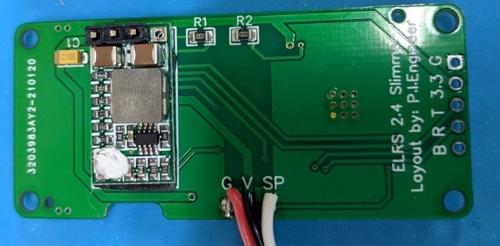

- Apply tape to the base of the regulator pcb to insulate it from potentially shorting with the vias on the main pcb. Solder on a 4 pin straight header, then remove the plastic bridge on the header so that the reg will stil flush with the main pcb on the bottom. NOTE: pictures show the v1 pcb with reg on the top, which is incorrect. The v1.1 PCB moved the reg to the underside of the main PCB, so it doesn't intrude on the antenna SMA.
- Solder 3x silicon wires to the 3 pin header pads (G, V, S), and attach to the 8 way header using the pinout below, so that G goes to GND, V goes to 6V, and S goes to S.Port.

### 3d Prints

- Print as shown below. Print with at least 50% infill.
- Supports used.

### Slimmer Case Build process and Pics

- Solder wires to connector
- Install from outside of module case
- Install module into radio
- Hot glue wires/connector to set location.  

- Solder wires to board
- install rf cable
- install rf cable to sx1280 board
- Neatly install in case

### Build process and Pics

- Solder wires to connector  
- Install from outside of module case  
- Install module into radio  
- Hot glue wires/connector to set location.  

- Solder wires to board
- install rf cable to case
- install rf cable to sx1280 board
- Neatly install in case
- Add 4 screws

- Solder wires to board  
- install rf cable  
- install rf cable to sx1280 board  
- Neatly install in case  

- Add 4 screws  

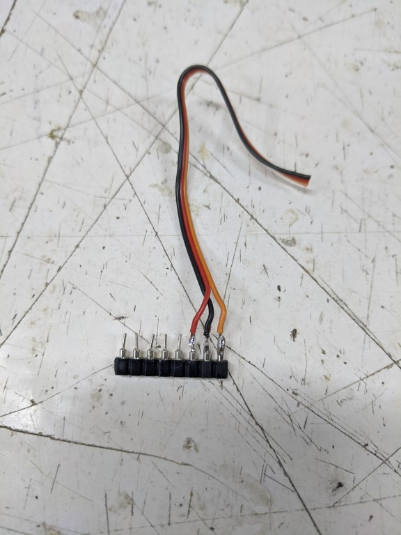 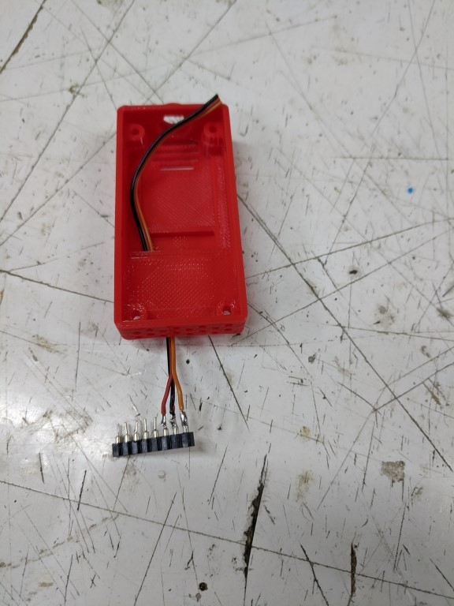
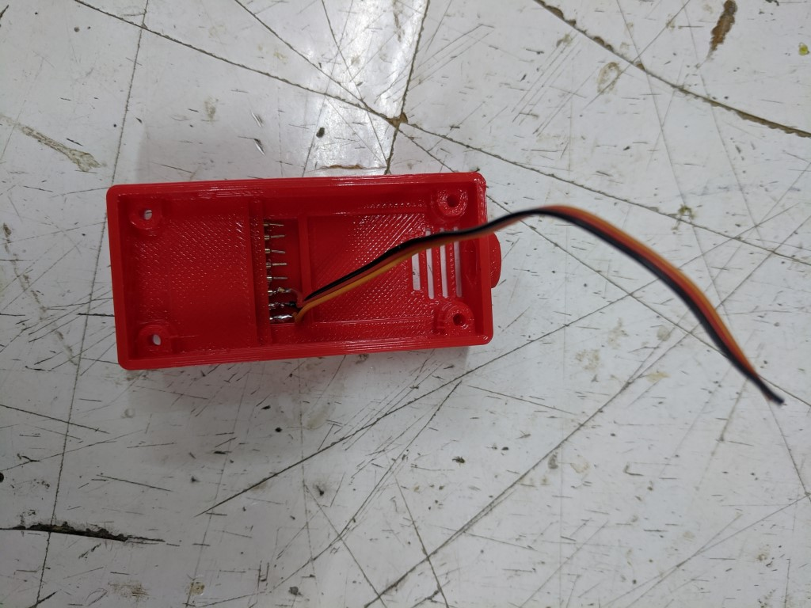 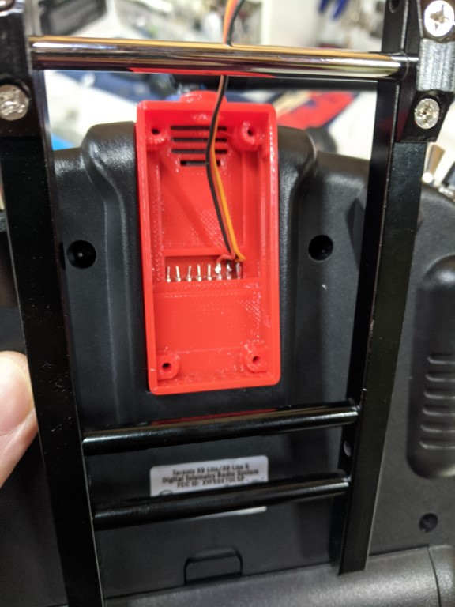 
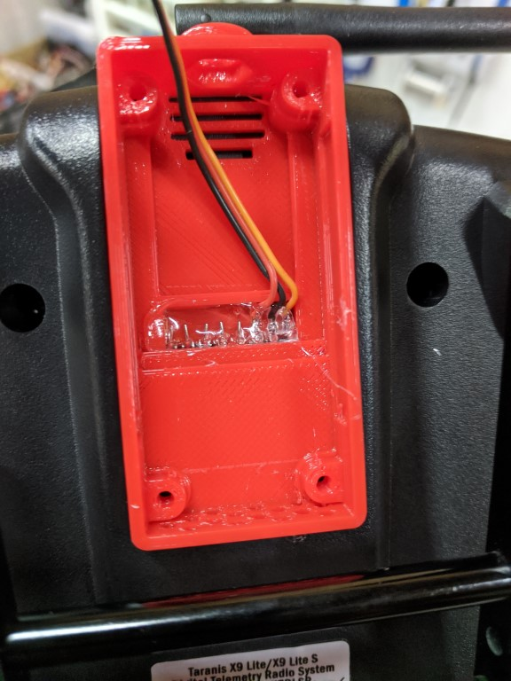  
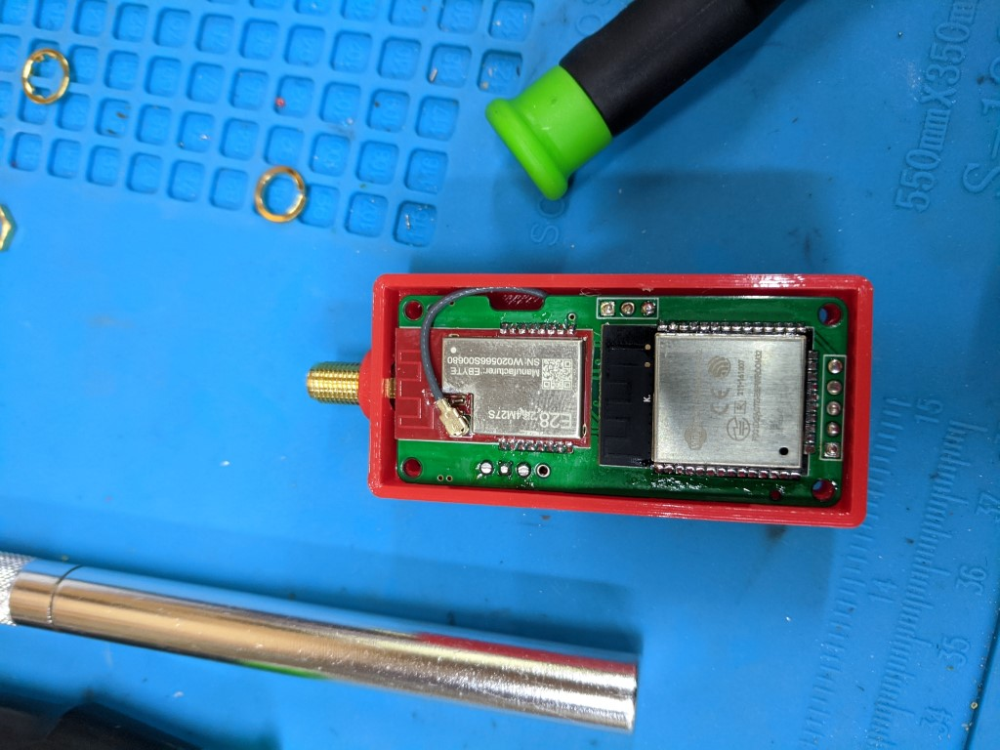 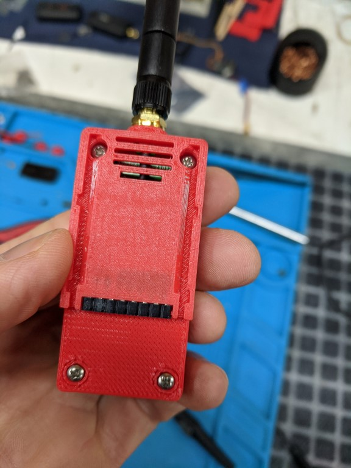 
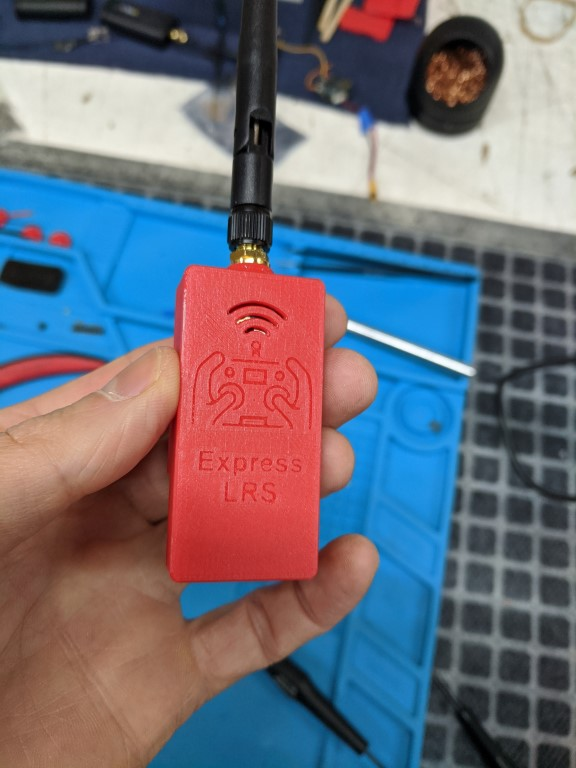

### JR Bay Case Build Process and Pics

- Note: Connector is 6 pin even though there are 5 pins on radio. It's what i had on hand for testing.
- Trim ears off of connector
- Install connector in case (please do test fit for pin alignment)
- solder 3 wires to slimmer board, same as above (see bay pinout pic)
- install board into case with 2 screws
- install sma into cover
- attach UFL antenna
- screw cover on w/4 screws

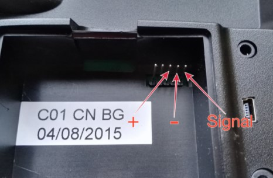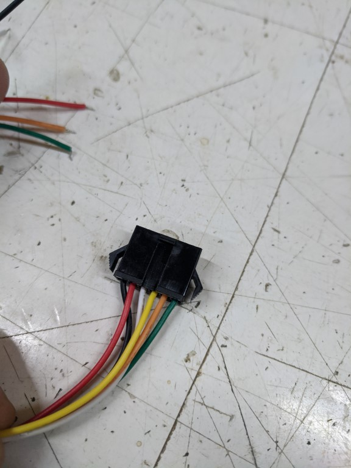 
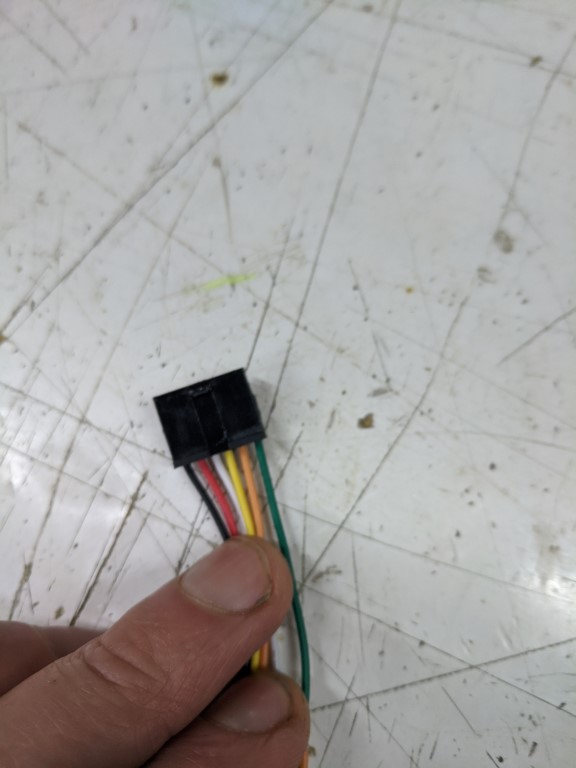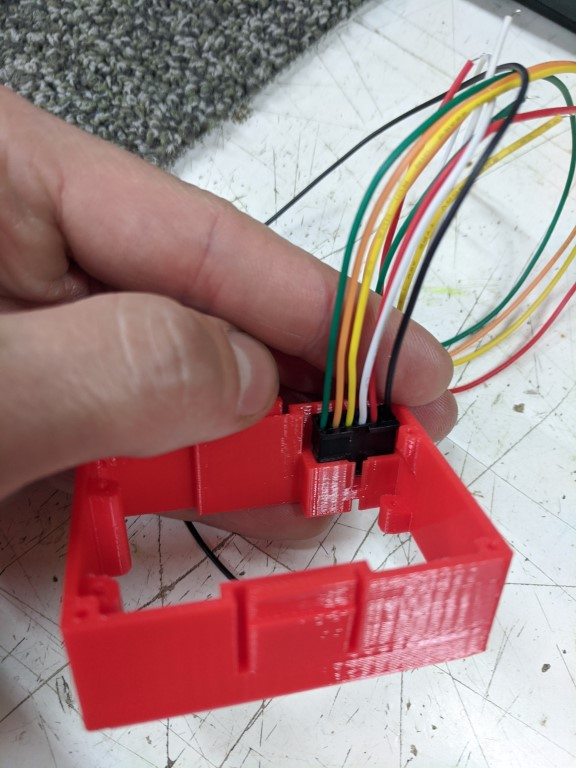 
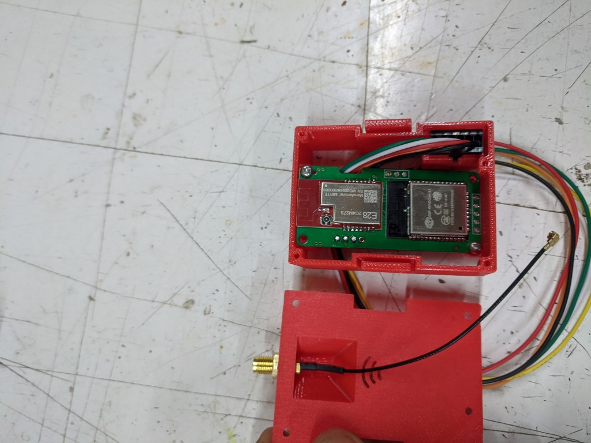 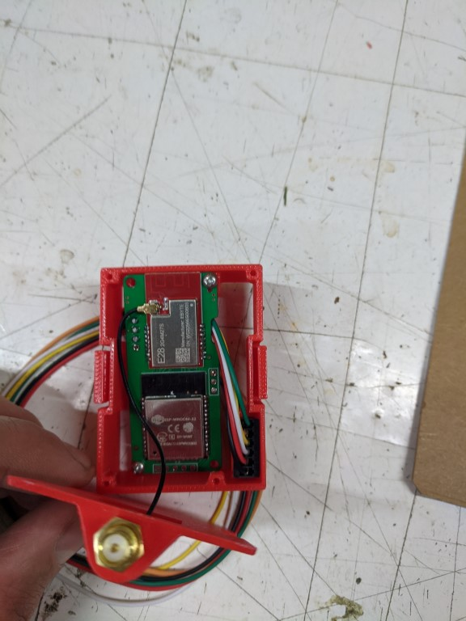 
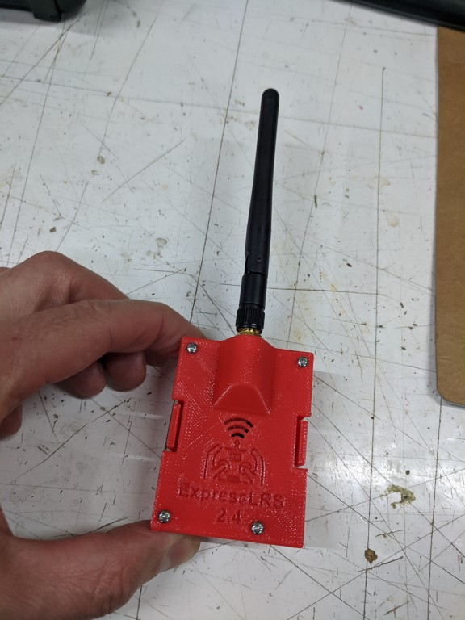 

### Schematic and PCB layout

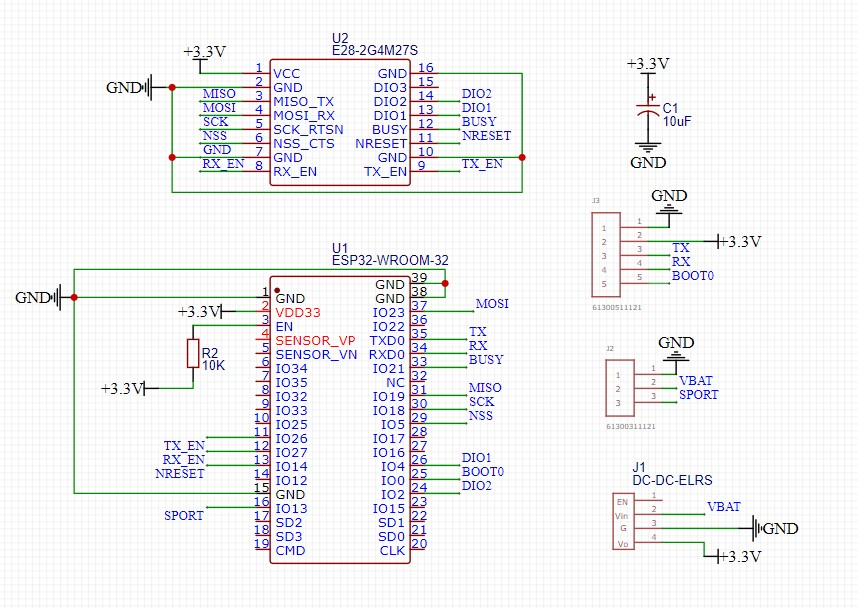

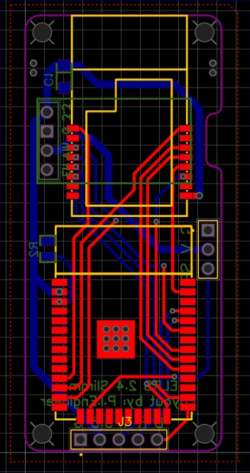

