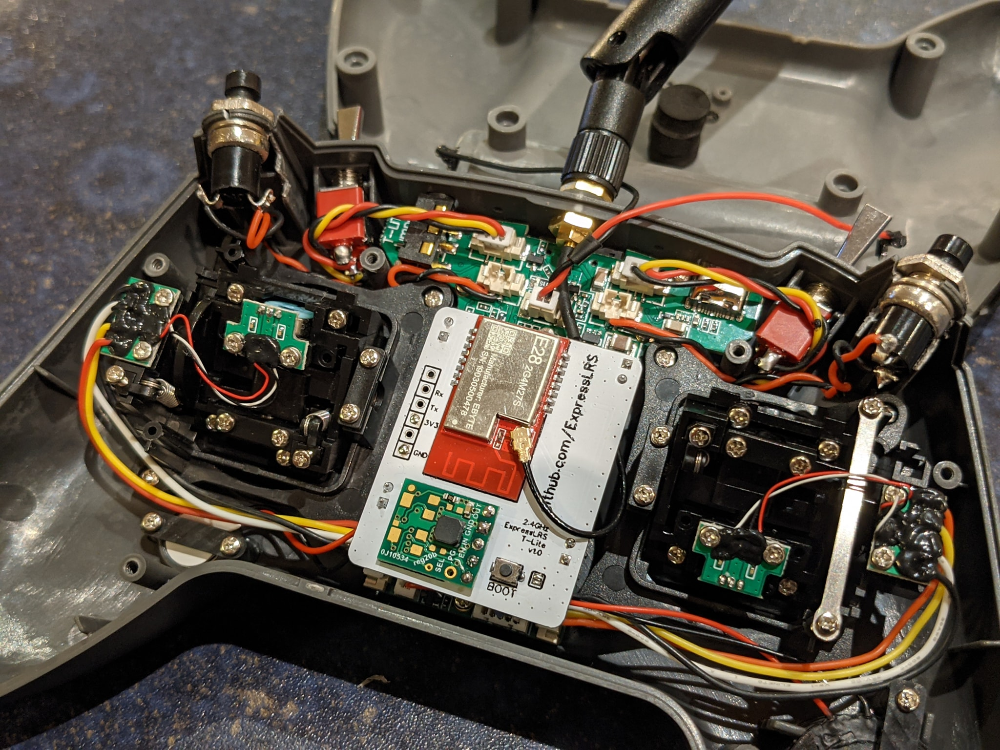
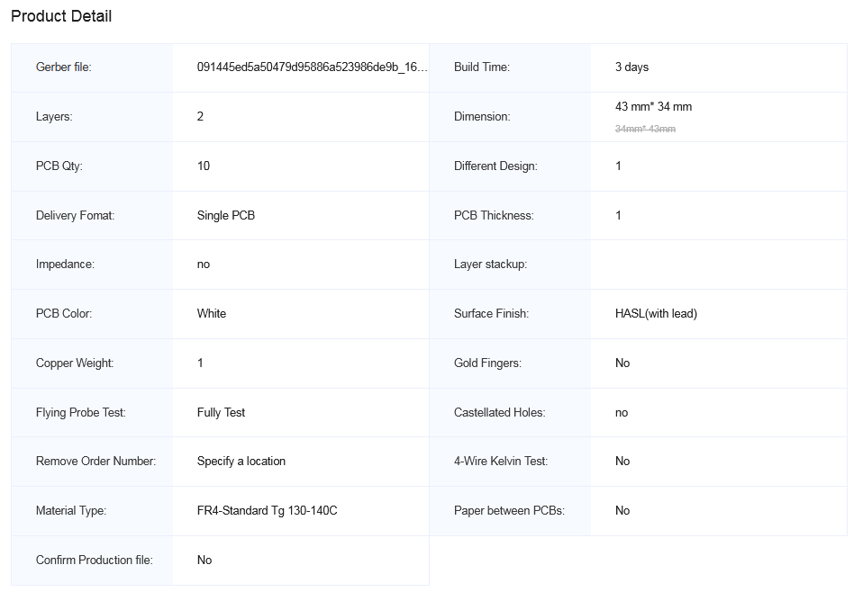

# Jumper TLite 2.4 GHz Tx

This internal module is a remix of the slim module.  Please check out that readme for further details on parts and flashing.

This module uses a separate step up/down regulator directly from vbat, so it does not have any output power limitations that typical external modules may have.

https://easyeda.com/jyesmith/expresslrs-jumper-t-lite

Build and flashing video https://youtu.be/8L0xCDgLQ8s

### PCB Order Details

Upload the Gerber file to https://jlcpcb.com/RAT

### BOM

Parts used are the same as the slim modules except for the step up/down regulator.  This is a Pololu S9V11F3S5C3 and you will need to hunt around to find a supplier near you. https://www.pololu.com/product/2873
