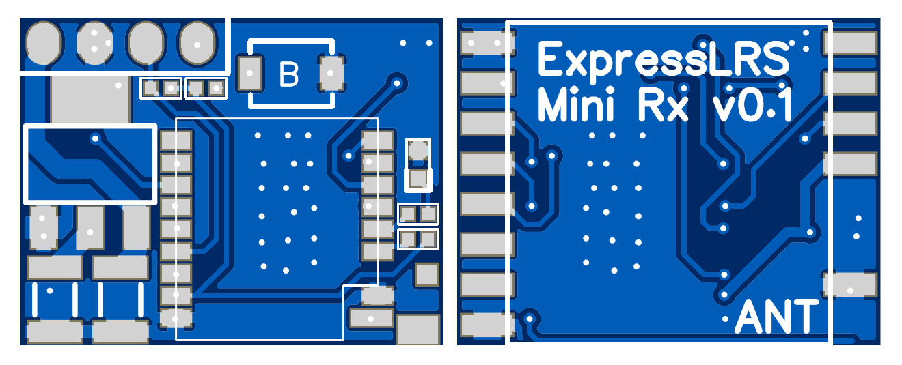
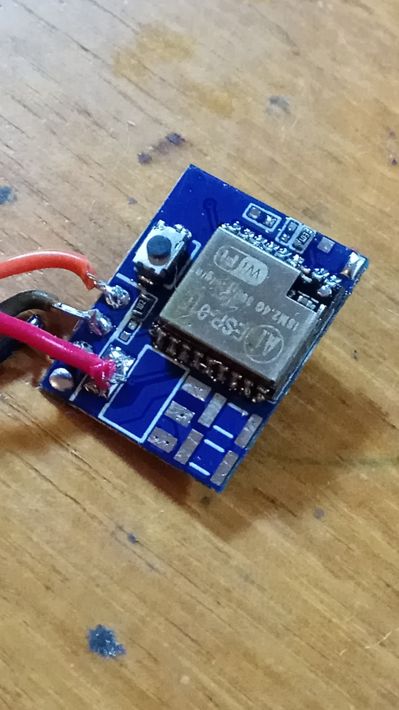

\# Mini Rx v0.1

https://easyeda.com/jyesmith/expresslrs-rx

   

\### PCB manufacturing

Upload the Mini_Rx_v0.1_Gerber.zip file to https://jlcpcb.com/

\- PCB Thickness 0.6m. Thicker is ok but the Rx becomes bulky.  Going thinner to 0.4mm costs more!

\- PCB Colour blue... Blue is best, but I suppose you could select something different.

\- [BOM](https://docs.google.com/spreadsheets/d/1T2mhwylJRkJdaq0IyqfzjkTpoj9uZ8fdSAFEOPCxJ9Y/edit#gid=179311956)... Thank you so much @Spec on the discord for this!

\### Component placement

Most of it should be self explanatory except for a couple of the resistors. The 10k Pull-Up Resistors are not necessarry and will be removed in a future version (EN and RST init HIGH).

Note - The WiFi antenna isn't required. A small 1/8th wavelength PCB trace was included and tested up to a distance of 5m.  It works well for flashing on the bench or in the field.

  

\### Minimum flashing requirements

ESP-01F, button (hold while powering to put into boot mode) and 2 x 10k resistors is all that is need to flash the esp. ***\*The red power wire is 3.3V\****. Use the same steps found in [Adding an ESP Backpack](https://github.com/AlessandroAU/ExpressLRS/wiki/ESP-Backpack-Addon), except use the ***\*RX_ESP8285_via_UART\**** target.

