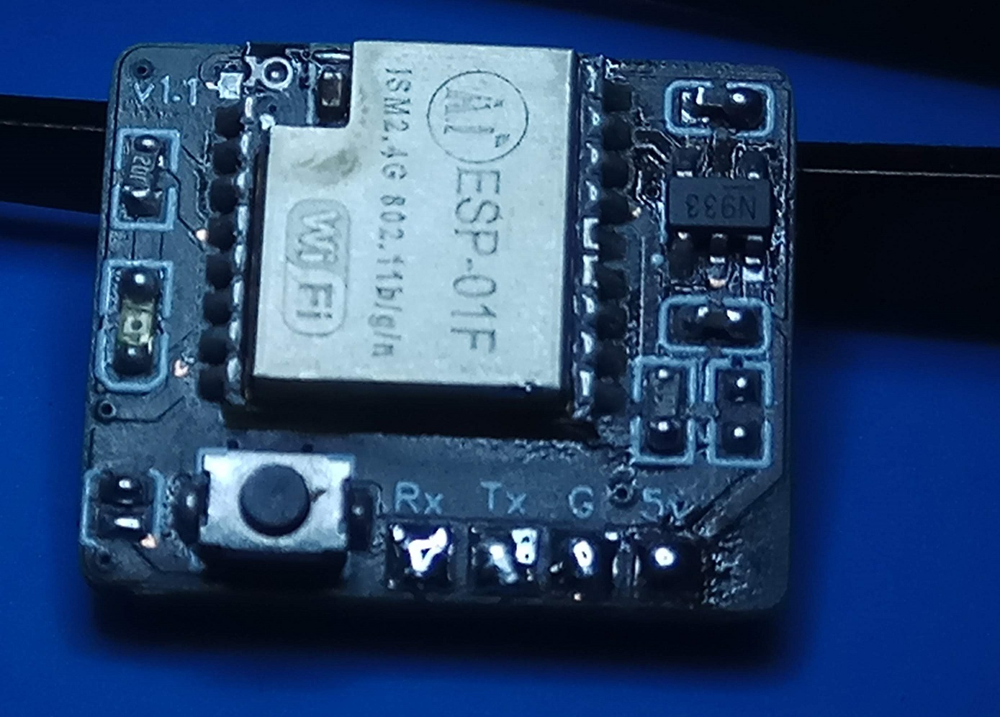
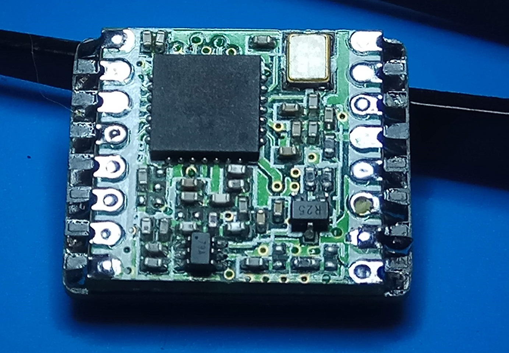
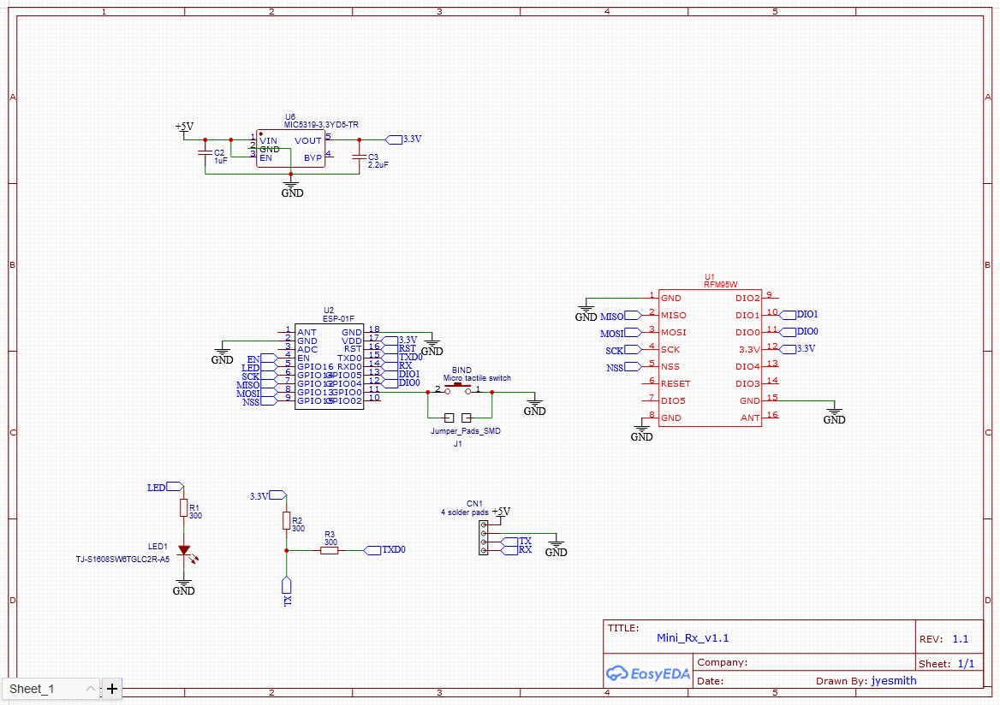
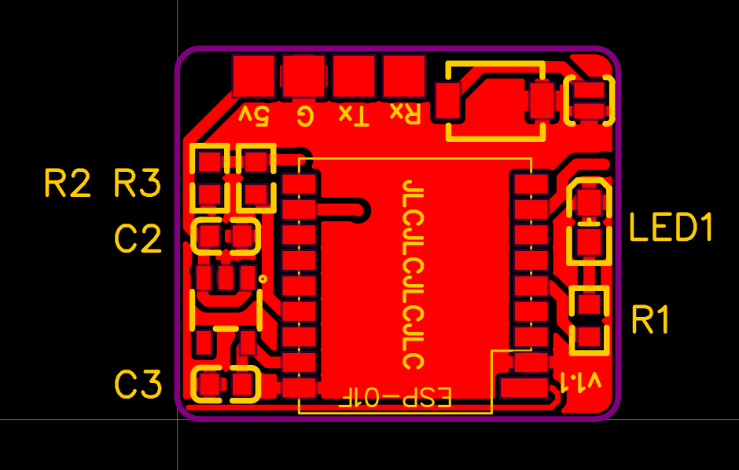

# Mini Rx v1.1

v1.1 PCB
- R2 placement is incorrect. Do not add R2 unless needed.

v1.2 PCB
- Corrects R2 placement. Do not add R2 unless needed.

This version contains minor changes to reduce the number of components, makes the PCB smaller, and uses the same voltage regulator as the 2.4GHz Nano Rx.

https://easyeda.com/jyesmith/expresslrs-rx

 

### PCB manufacturing

Upload the Mini_Rx_v1.1_Gerber.ara file to https://jlcpcb.com/RAT

- PCB Thickness 0.6m. Thicker is ok but the Rx becomes bulky.  Going thinner to 0.4mm costs more!
- Check the price for 5, 10, and 30 pieces. It is sometimes cheaper to order 30 than 10 and only a minor increase in price compared to 5.

### Component placement

Most of it should be self explanatory :)

__!!! DO NOT ADD R2 !!!__ It is not required unless you run into boot issues due to the flight controller pulling the pin low during powerup.

Boot jumper pads have been added next to the button as an alternative.  Typically it is easier to use the jumpers for the initial flash, and then wifi updating for future updates.

 

__!!! V1.1 PCB Correct R2 placement !!!__

If R2 is required and you have a V1.1 PCB, place the resistor as indicated below.

### Flashing

- Solder the jumper pads or hold the button down while powering up.
- Connect an FTDI adapter.
- Upload target DIY_900_RX_ESP8285_SX127x_via_UART.
