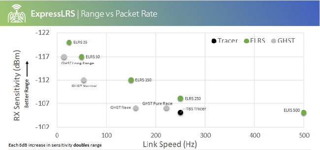
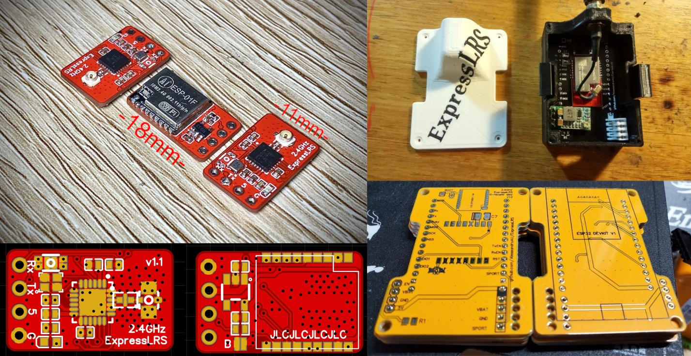
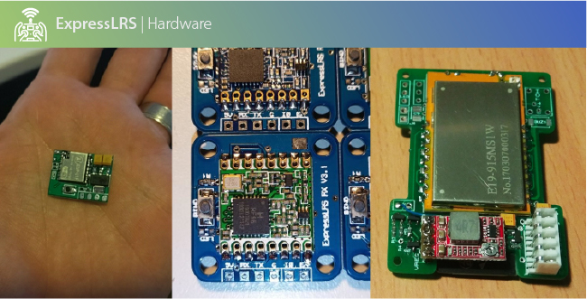

## Need help? Confused? Join the Community!
 * [Discord Chat](https://discord.gg/dS6ReFY)
 * [Facebook Group](https://www.facebook.com/groups/636441730280366)

## High Performance LoRa Radio Link

ExpressLRS is an open source RC link for RC applications. It is based on the fantastic semtech **SX127x**/**SX1280** hardware combined with an **ESP8285**, **ESP32** or **STM32**. ExpressLRS supports a wide range of hardware platforms as well as both `900 MHz` and `2.4 GHz` frequency options. ExpressLRS uses **LoRa** modulation as well as reduced packet size to achieve **best in class range and latency** compared to current commercial offerings. 

ExpressLRS can run at various packet rates, up to `500hz` or down to `25hz` depending on your preference of range or low latency. At `900 MHz` a maximum of `200 Hz` packet rate is supported. At `2.4 GHz` a blistering `500 Hz` is currently supported with a custom openTX binary with future plans to extend this to `1000 Hz`.

ExpressLRS can be flashed into existing **Frsky R9M hardware (RX and TX)**, **Jumper R900 RXs**, **GHOST ATTO/ZEPTO Receivers** or **Custom PCBs** can be made if you enjoy tinkering. Several manufacturers are preparing to offer offical ELRS hardware soon so stay tuned. 

ExpressLRS aims too achieve the best possible link preformance for both latency and range. This is achieved with an optimised over the air packet structure.  However, only basic telemetry is currently provided (**VBAT**, downlink/uplink **LQ** and downlink/uplink **RSSI**), work is underway for full telemetry support. This comprimise allows ExpressLRS to achieve simultaneous **better latency AND range** compared to other options in the market. For example, **ExpressLRS 2.4GHz 150Hz** mode offers the same range as **GHST Normal** while delivering near **triple** the packet update rate. Similarly, **ExpressLRS 900MHz 200Hz** will dramatically out-range **Crossfire 150Hz** and **ExpressLRS 50Hz** will out-range **Crossfire 50Hz** watt per watt.   

**2.4GHz Comparison**

More information can be found in the [wiki](https://github.com/AlessandroAU/ExpressLRS/wiki). 

## Starting Out

After taking a look at the [supported Hardware](https://github.com/AlessandroAU/ExpressLRS/wiki/Supported-Off-The-Shelf-Hardware) and making sure you have the required hardware, the [Quick Start Guide](https://github.com/AlessandroAU/ExpressLRS/wiki/Toolchain-and-Git-Setup) is written to walk through the process of flashing ELRS for the first time

## Hardware Examples

### 2.4GHz DIY Receiver and Transmitter

Links:
- [Nano 2.4GHz RX](https://github.com/AlessandroAU/ExpressLRS/tree/master-dev/PCB/2400MHz/RX_Nano) Currently Smallest DIY 2.4Ghz RX
- [20x20 2.4GHz RX](https://github.com/AlessandroAU/ExpressLRS/tree/master-dev/PCB/2400MHz/RX_20x20) Convenient Stack Mounted DIY 2.4GHz RX
- [JR Module 2.4GHz TX](https://github.com/AlessandroAU/ExpressLRS/tree/master/PCB/2400MHz/TX_SX1280) Fits in JR bays, up to 500mW TX power
- [SuperSlim 2.4GHz TX](https://github.com/AlessandroAU/ExpressLRS/tree/master/PCB/2400MHz/TX_SX1280_Slimmer) Ultraslim module, fits in any lite bay, same power limit as it's bigger brother

### 868/915MHz DIY Receiver and Transmitter

Links:
- [Mini 900MHz RX](https://github.com/AlessandroAU/ExpressLRS/tree/master/PCB/900MHz/RX_Mini_v1.1) Currently Smallest DIY 868/915MHz RX
- [20x20 900MHz RX](https://github.com/AlessandroAU/ExpressLRS/tree/master-dev/PCB/900MHz/RX_20x20_0603_SMD) Convenient Stack Mounted DIY 20x20mm 868/915MHz RX
- [20x20 900MHz RX](https://github.com/AlessandroAU/ExpressLRS/tree/master-dev/PCB/900MHz/RX_20x20_0805_SMD) Convenient Stack Mounted DIY 20x20mm 868/915MHz RX

## Long Range Competion
One of the most frequently asked questions that gets asked by people who are interested in, but haven't yet tried ELRS is "How far does it go, and at what packet rate?"

The following table is a leaderboard of the current record holder for each packet rate, and the longest distance from home. Note that not every flight resulted in a failsafe at max range, so the link may go (much) futher in some cases.

### Rules
Anyone can add an entry to the table, and entries should include the:
- Max distance from home,
- RF freq (900 / 2.4),
- Packet rate,
- Power level,
- If the link failsafed at max range,
- The pilot name, 
- A link to your DVR on youtube (DVR is essential to compete, sorry, no keyboard claims)

### Current Leaderboard
| Max Dist. | Freq | Pkt Rate | TX Power | Failsafe at Max Range? | Pilot Handle | Link to DVR |
| ---- | -------- | -------- | --------- | ---------------------- | ------------ | ----------- |
| 30Km | 900M | 50HZ | 1W | No | Snipes | https://www.youtube.com/watch?v=SbWvFIpVkto |
| 10Km | 2.4G | 250HZ | 100mW | No | Snipes | https://youtu.be/dJYfWLtXVg8 |
| 6Km | 900M | 100HZ | 50mW | No | Snipes | https://youtu.be/kN89mINbmQc?t=58 |
| 4.77Km | 900M | 200HZ | 250mW | No | DaBit | https://www.youtube.com/watch?v=k0lY0XwB6Ko |
| 2.28Km | 900M | 50HZ | 10mW | No | Mike Malagoli | https://www.youtube.com/watch?v=qi4OygUAZxA&t=75s |

Check the [wiki page](https://github.com/AlessandroAU/ExpressLRS/wiki/Range-Competition) for previous leaders!

## Legal Stuff
The use and operation of this type of device may require a license and some countries may forbid its use. It is entirely up to the end user to ensure compliance with local regulations. This is experimental software/hardware and there is no guarantee of stability or reliability. **USE AT YOUR OWN RISK**

