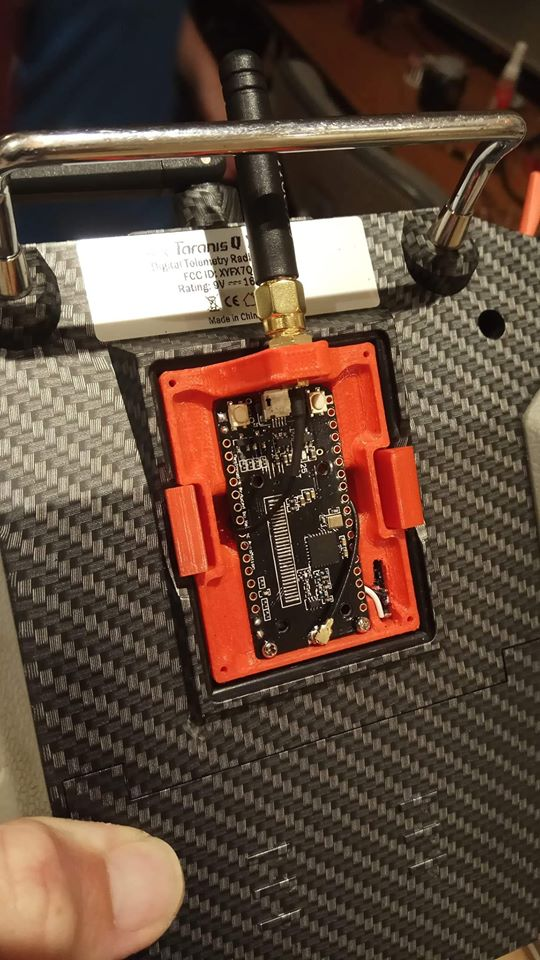
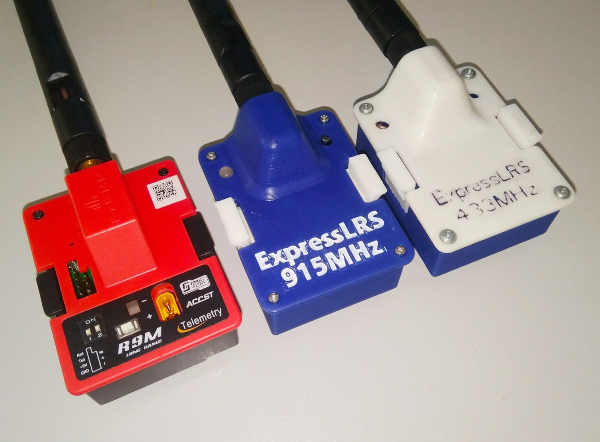
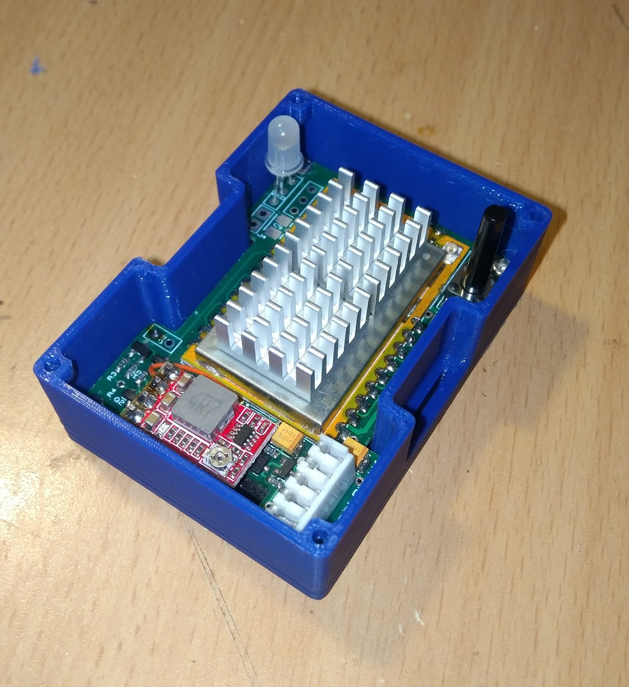
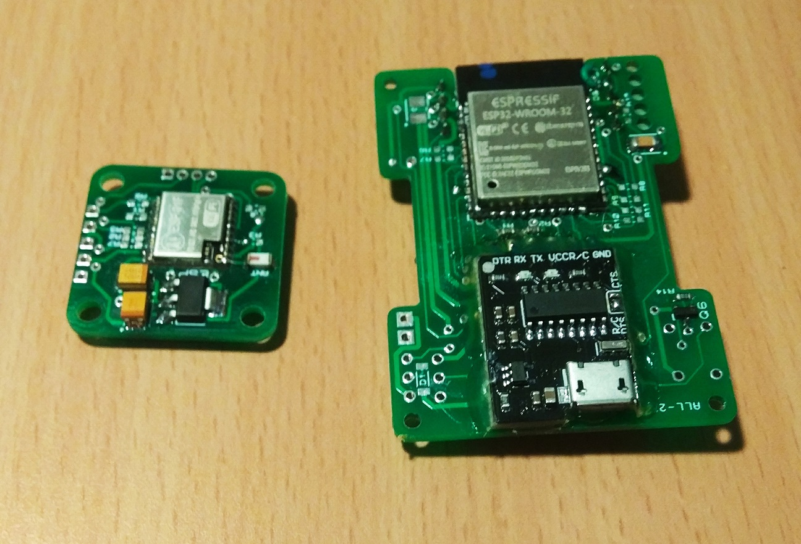
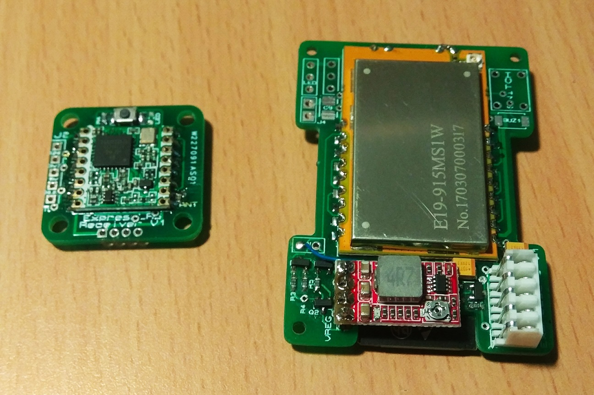
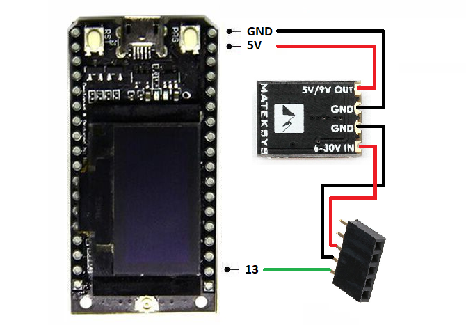
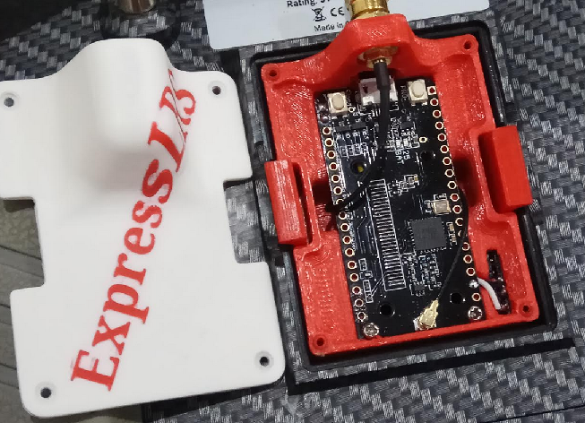

# ExpressLRS
ExpressLRS is an open source RC link for RC aircraft. It is based on SX127x hardware combined with an ESP8285 and ESP32 for RX and TX respectively.

It can be built with various hardware or customized to suit. The standard build fits in a JR module and the standard RX can be mounted in a 20x20mm stack.

It can run at 200 Hz, 100 Hz or 50 Hz depending on if you prefer range or low latency. At 200 Hz it is the fastest 900/433 MHz RC link on the market with a Stick -> OpenTX > RF -> RX -> Serial Packet Latency of ~10ms.

Due to the optimized packet structure only basic telemetry that gives uplink/downlink information is currently supported. This system does FHSS over 20 channels combined with LoRa modulaiton.

TX and RX modules communicate via the standard CRSF serial protocol for easy use with Betaflight and openTX.

Compared to commerical R9M or XF systems ExpressLRS is also very affordable, a TX module can be built for $30 and recievers for $15-20.

## UPDATE:
Now supports using easily available TTGO LoRa boards as TX modules for much easier assembly!  Build information below.

## Building a TX Module:

For the build you will need a TTGO LoRa board, with or without an OLED.  These boards are readily available from ebay, aliexpress, and banggood.  The only others parts required are some wire, 5 pin female header, and your favourite 5V regulator that can take the transmitters battery voltage range.

Note - The board I bought came with a female SMA pigtail.  Check your antenna is suitable.

[LILYGO TTGO LoRa](http://www.lilygo.cn/prod_view.aspx?TypeId=50003&Id=1134&FId=t3:50003:3)
/
[AliExpress TTGO LoRa (no OLED)](https://www.aliexpress.com/item/4000059700341.html)
/
[AliExpress TTGO LoRa (with OLED)](https://www.aliexpress.com/item/32840238513.html)

STLs for printing your own enclosure are available in the [STL folder](https://github.com/AlessandroAU/ExpressLRS/tree/master/STL).

