# Gyro

> **Warning**: This is an experimental branch not ready for prime time. **Experiment at your own risk**.

> **Rate-Mode** seems to work faily well, even on Delta/Vtais.

> **Auto-Level** seems to loose level if you do high rotation aerobatics (tight loops, snap rolls) before engaging auto-level. Takes like 10s before it recovers to level. If you fly normally, even nice aerobatics, it works well.

**NEW from 1.08**. New hardware\target.json is needed to enable the gyro.. See instructions at the end of the file
in the "building your own code" section.

## Credits

This code is an adaptation of the original gyro code created by Alex Wigen [Original Code](https://github.com/awigen/ExpressLRS/tree/add-rx-gyro-support).

A lot of code has been changed from the original to make it easier to setup.  Some parts of code has been taking from other open source project, including [INAV](https://github.com/iNavFlight/inav), and [OpenXSensor Gyro](https://github.com/frankiearzu/oXs_on_RP2040).

## Feature list
- [x] Quick Model Setup
  - [x] 1-Click setup of all the setting for the Gyro to work
  - [x] Wing-Type: Normal, 2-Ail, Delta
  - [x] Tail-Type: Normal, VTail, Taileron, Rudder-only
    - NOTE: Haven't flight tested Delta or Vtail.. so do your ground tests!
    
- [x] Model Setup
  - [x] Mode Switch Flight-mode Assignments
  - [x] Lua channel assignments  (what the channel is used for)
  
- [x] Gyro Settings
  - [x] Fight Mode parameters configurable per flight mode.
    - [x] Rate (Wind Rejection), Envelope (like Spektrum RC SAFE envelope), and Auto-Level
    - [x] Gains for Roll,Pitch,Yaw
    - [x] Max angle Limits for Auto-Level and Envelope
    - [x] Angle Trims  for Auto-Level and Envelope
    - [x] Allow to use Rate together with other modes at the same time.

  - [x] Stick Calibration
    - [x] Simplified Gyro servo output Limits (center sticks, move sticks)
    - [x] Scale corrections according to channel limits, and gains

  - [x] Gyro Calibration
  - [x] Simplified Gyro RX Orientation (Set model level, then vertical)  

  - [x] LUA PID adjustment settings (Advanced)
  - NOTE: Only horizontal orientation right now, with any side face facing the front.  Need to fix this.

- [x] Multiple Flight Modes
  - [x] Gyro mode: Rate (Gyro Wind correction on)
  - [x] Gyro mode: Envelope  (Max Angle Envelope)
  - [x] Gyro mode: Auto-Level (Auto-Level + Max angle Envelope)
  - [x] Gyro mode: Launch (Level + pitch up)
  - [ ] Gyro mode: Hover (NOT READY)

- [ ] Stick Priority for VTail/Delta
  - Currently it will use the Elevon channel for both Roll/Pitch, and Vtail for Pitch/Yaw. Somehow Spektrum RC can separate them properly, even though the radio send then together. So there is a way! Probably analyzing when both move together is Pitch, and separate are Roll/Yaw. 

## Getting started

The general idea is:

1. Flash the receiver using this branch.
2. Configure receiver to expose `SCL`/`SDA` pins (if needed, can be done in the hardware page of the receiver WebUI)
3. Copy the `elrs.lua` Lua script from this branch to the transmitter `SCRIPTS/TOOLS/` directory
4. Wire the receiver to the gyro (if needed)
5. Wire the receiver to the servos (if needed)
6. Create an adequate model in the transmitter
7. Power on the transmitter, the receiver, and bind/connect as usual
8. Run the Lua script to configure the gyro
9. Test carefully before flying
10. Trim the gyro from flight testing observations

### Receiver setup

#### HelloRadioSky HR7EG/HR8EG

I got some of the new RX with Gyro from Hello Radio Sky to play (Thanks Ken!). 
The idea is to have code that works out-of-the box for those receivers.

<b>These are prototype receivers.. not yet for sale, but for developers/testers</b>.
Hopefully they will be on the market soon.

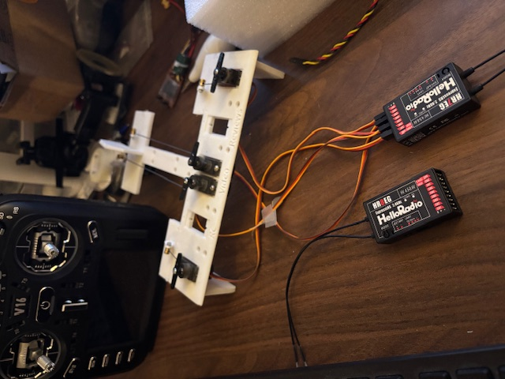

#### Other (DIY)

It is also possible to add an external gyro to some receivers, by connecting it to the I2C bus.

##### Receivers

- BetaFPV Super-P
- RadioMaster ER8, ER6

##### Gyros

- MPU-6050: Very common, and supports 5V.
- LSM6DSO IMU: Not that common, but trying to support the family of LSM6Dxx. Not that friendly since it only supports 3.3V, and will need a regulator.

#### Wiring

Example: BetaFPV SuperP receiver with an external MPU-6050 I2C module. 

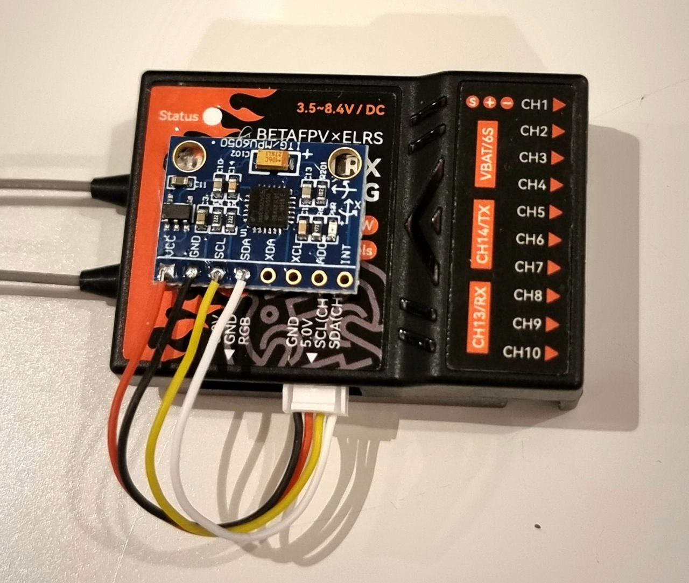

### Transmitter setup

A model should be configured as usual, then two additional channels can be used to control the gyro.

1. Setup your model as usual to fly without a gyro.
2. **Flight Mode Switch**: `CH9` is used as the **flight mode** switch by default. This channel is  used to select the active stabilization mode.
3. **Gyro Gain**: `CH10` is used as the **gyro gain** by default.

The defaults can be changed when configuring the gyro.

**Note**: You only want variable gain while you test flight and adjust the Rate gains for your flying. After you are happy, you want to set it to fixed, so is stored at each model/plane in your radio and no longer use the Dial/Slider.

Once you find the right setting, Note on the top of your `CH10` bar where it is (`+65%` for example). Then change it to `source` `MAX`, and change the `weight` to `65%`.  The output should reflect the same as you started. Later on, you can have multiple settings depending on your flight mode , switch, or `Thr` (See how the Two-Brothers RC videos..High gains on the landings controlled by `Thr` via a curve and delays)  

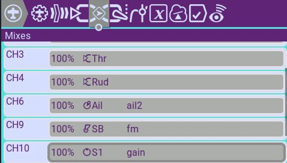

### Gyro configuration

Video showing the configuration: [ELRS + HelloRadioSky Gryo Receivers](https://www.youtube.com/watch?v=Wk4s1B-1F_4)

**IMPORTANT: Use the `elrs.lua` from this branch, since the gyro use multiple nested level of menus** it will show in the screen as (r17-gyro). Additionally, when you navigate to a sub-menu, the title will show in the middle. Even with that, only the current screen refreshes with changes.. not the other screens. Sometimes is better to just restart the LUA to get the most recent values.

The gyro settings are available through the
[ExpressLRS Lua script](https://www.expresslrs.org/quick-start/transmitters/lua-howto/).

#### Finding the settings menus

1. First launch the ExpressLRS Lua script.
2. Go to "Other Devices".
3. Select your receiver.
4. If your receiver is correctly flashed you will see gyro menu items. 
5. If you are using the ELRS.lua from this branch, you will see the sub-menu title when navigating into another sub-menu.

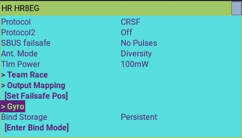
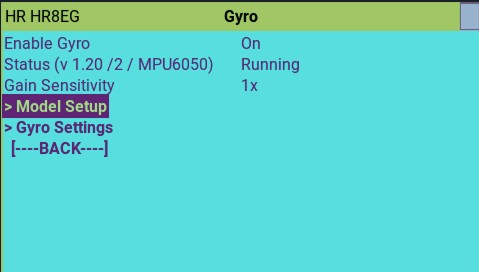

#### Gyro Menu

By default, the Gyro will be OFF. This RX will work normally without Gyro functionality.
On the status, it shows:
  * the Gyro software version
  * the storage configuration version (important for developers to do automatic upgrades of gyro configuration for future versions)
  * IMU/MPU detected: MPU6050 or LSM6Dxx are supported

The faster way to get things up and running is to:

1. Quick-Setup:  Go to Model-Setup -> Quick Setup to define your plane. This will reset the RX to factory defaults and setup the type of plane you choose.  NOTE: Restart the LUA script.
1. Turn the Gyro ON in the main gyro page.
1. Go to Gyro-Setting: Perform Gyro Calibration, Perform RX orientation

#### Quick Model Setup

#### Quick Setup

In here, you can setup your RX/Gyro really quickly.   Select your wing-type and tail-type, then execute.   This will setup completely the model part of the gyro. It will do:

1. Configure All options of the gyro to the default Factory settings.
2. Configure Ch Functions for the specified plane.
3. Configure flight-mode switch on Ch9 to have a 3-pos switch:  Off, Rate, Level
4. Configure Master gain on Ch10.
5. The only thing missing will be to turn the Gyro ON, do calibration, and validate that the gyro moves the surfaces correctly

**Note**: Currently, the Lua script only refreshes the current page. All other pages will have the previous values. Since Quick-Setup changes every setting in the RX, please restart the Lua script to make sure all the values/screens are refreshed.

#### Main Gyro Screen

1. Enable Gyro: Turn On/Off the gyro functionality
2. Status: Give you the version and the IMU detected (MPU6050,LSM6Dxx). "---" if it cant detect the IMU.
3. Gain Sensitivity for "Rate". Quickly change the sensitivity. If your gyro is too sensitive even when adjusting the master gain Dial/Slider to low, probably you want to lower the sensitivity, if you are at 100% on the Gain dial/slider, and the plane needs more, increase it. Some recommendations:

    - Start low Master Gain (Slider/Dial) 
    - EDFs/Fast planes you want to start at 0.5x
    - Slow planes, you might need 1.5x or 2x.
    - For Gyro Direction testing, you might need to go to 2X to see the surfaces moving!

#####  F-Mode Switch Settings

Here you can select what flight mode do you want on each position of the switch. A typical 3-pos switch will have -100,0,+100.

If you want all 5 positions, set channel mode with a 3-pos switch to a weight of 50%.. That will give you -50,0,+50.  Use a special function to activate the -100 or +100.   

For example, set -50=Off, 0=Rate, +50=Envelope, +100=Auto-level. Your 3-pos witch will take care of the first 3.  To active Auto-Level (panic), create a special function on another switch (ex. SH) to override the mode to +100.. now you have 4 modes.

 

#### Model Setup: CH Functions

In the "Ch Functions" menu you can setup what is the functionality for each channel.

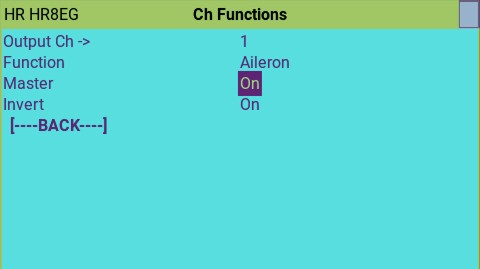

The gyro functions are:

* Aileron, Elevator, Rudder 
* Elevon output  (Elevator + Aileron Mix: Left and Right)
* V-Tail output  (Elevator + Rudder Mix: Left and Right)
* Gain - Gain Mode Channel
* Mode - Flight Mode Switch

Master: When you have multiple Aileron or Elevators, the gyro needs to know who is the "master", the others are "Slaves". The one marked "master" will be the one that the Gyro will use for monitoring the stick movement for Roll, Pitch, Yaw.

Invert: If your gyro is correcting in the wrong direction the surface, you need to Invert/Reverse that ch.

For Elevon/Vtail,  first make the Elevator to work on the right direction, then use the Left/Right (example VTail_L or VTail_R) option to invert the secondary function (`Ail` or `Rud`).

Also you need to assign a channel for Gyro "Mode" selection switch and "Gain", the master gain channel.

#### Gyro modes

##### Rate Mode

Also called wind-rejection mode.. it will try to correct quick rotational movements of the plane. The gyro will quickly react and try to keep the plane in the same attitude as it was before the wind try to affect it. 

* Stick Priority: It is a variable gain depending on the stick deflection. At what point on the stick deflection the gyro has no action.  At stick center, gyro has 100% gain of movement and start declining as you move the stick outwards. At stick 1/2 movement outwards the gyro has 50% gain of movement, and at full deflection 0% gain.    When set to 100% (Full deflection) is when gyro reach 0 gain, When set at 50% (50% deflection), the gyro reach 0 at 1/2 stick deflection.

* Gains:  This are the Gains for each axis.. higher value makes the gyro moves more the surfaces for that axis.

##### Level Mode (Angle Demand)

In this mode the gyro will work to keep the plane flying level when the sticks are centered.  It also will not let you bank/pitch past the Angle Limits.

If you move the stick 1/2 way to the side, the plane will not bank/pitch more than 1/2 of the Max Angles. Example: if your Limit Roll is 70 and your stick is 1/2 way out, the plane will fly at 35 deg bank angle.  For this reason, this mode is also called "Angle Demand".

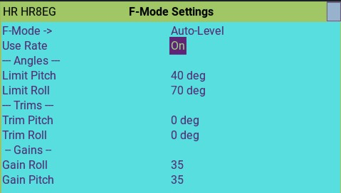

* Use Rate: it will combine the gyro "Rate" functionality here for wind rejection.  

* Trims:  For Auto-level, if your plane is not flying level, you might need adjust the trim. For pitch, positive(+) is nose up, negative (-) is nose down. For roll, positive is left.

* Limit Pitch/Roll: Maximum angles.. Will not let you pass that angles

* Gains: How strong the gyro should try to return the plane to level.
  35 (35% of total movement) is a good start for soft movement, increase the gains to make it go back to level faster/aggressive when releasing the sticks.

##### Envelope Mode (Max Angle Envelope protection)

In this mode the gyro will work to limit pitch and roll angles within the configured limits.

Once you reach the Max angle, the gyro will not allow to go any further.. you need to move the stick to center and opposite direction to go back to normal.

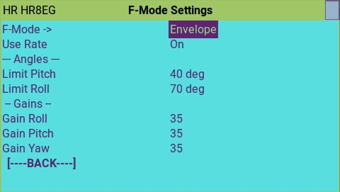

* Use Rate: it will combine the gyro "Rate" functionality here. Otherwise it will be like "Rate" OFF, and gyro only activates when max angles are reached.

* Limit Pitch/Roll: Maximum angles.. Will not let you pass that angles

* Gains: How strong the gyro should try to keep you at that max angles.
  35 is a good start for soft movement.

##### Hover Mode

NOT TESTED
In this mode the gyro will add corrections to elevator and rudder channels in
order to keep aircraft pointing directly upwards.

#### Calibration

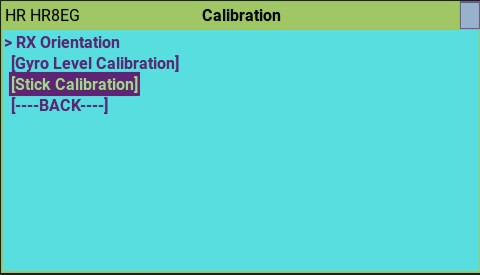

1. RX orientation.. You will set the plane level (learn level trim), and the set the plane with the nose up to learn what is the front of the plane.  It will tell you what Face of the RX is facing up when is on the Horizontal or Vertical position.  if it says "WRONG", i have not detected the positions.

1. Gyro Level Calibration: The RX orientation already did the Level calibration in its first step.  But it you only want to calibrate level only, you can run it again.

1. Stick Calibration is to learn the center and max travel of `Ail`, `Ele` and `Rud`.  

#### PID (Very advanced)

NOTE: Don't touch it unless you know what you are doing, and know how to configure the PIDs and its meaning.

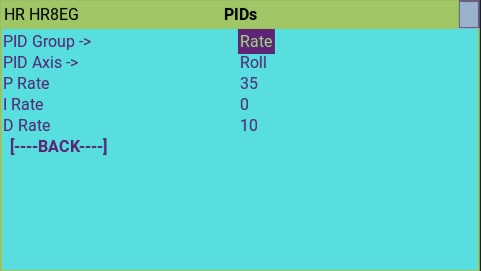

The gyro uses two configurable PIDs, one for rate, one for all angular modes (Level, Envelope, Hold)

* PID-GROUP:   PID for Rate, and PID for Level/Envelope/Hold
* PID-Axis: Axis to configure (Roll, Pitch, Yaw)
* P,I,D values:  NOTE: very careful with the I gain.

# Building your own

1. You will need to use GitHub desktop to clone my repository and branch to your local computer.  
    - do "file"-> "Clone Repository"
    - in the URL tab, type "https://github.com/frankiearzu/ExpressLRS"
    - It will download into a folder like this "C:\Users\frank\Documents\GitHub\ExpressLRS".
    - You can either choose my latest code by switching to the "gyro-dev" branch, or from the history, you can check out a tested/flow version using a "tag", tags will looks like "v1.11-Stable", by chossing on the left pannel "history", then right click on the tag you want, and "check out tag" (the warning that you are checking out a headless tag/branch is ok) 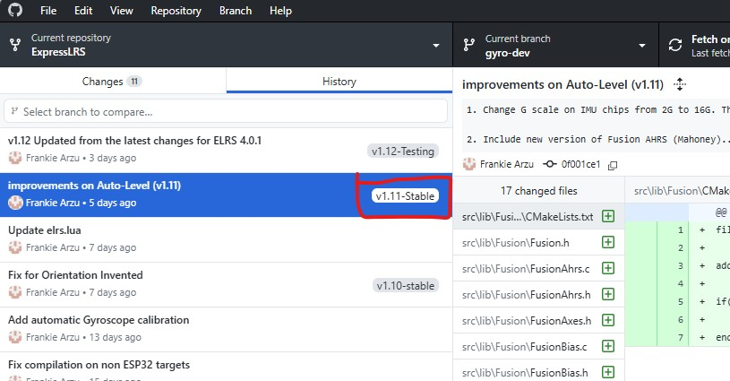

2. Start ELRS Configurator, and choose to do a "local" build. Select the non-gyro version of your RX to do the first buid. This will create the folder "src/hardware" and all official ELRS RX files.
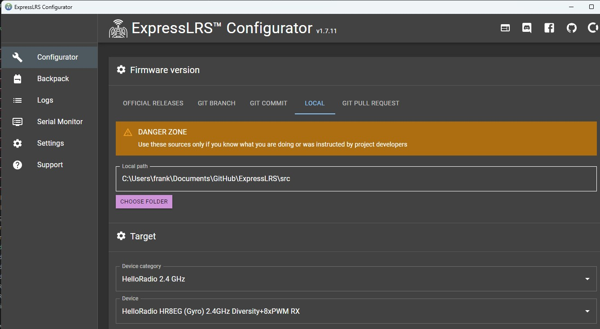

3. We will custumize our RX targets, and create a "gyro" version of them using the instructions below.

## Add new RX targets for configuration.

**NEW From 1.08**
New way to enable gyro:   in the folder src/hardware the file "targets.json" descrives the hardware settings for a given RX.
To enable gyro, we need to add the "gyro_type" to the overlay section.

For example, is you have a HR8EG, the official targets only have the non-gyro version of it.
So we copy the entire JSON of the non-gyro RX, and we add the gyro_type to the overlay, like this:
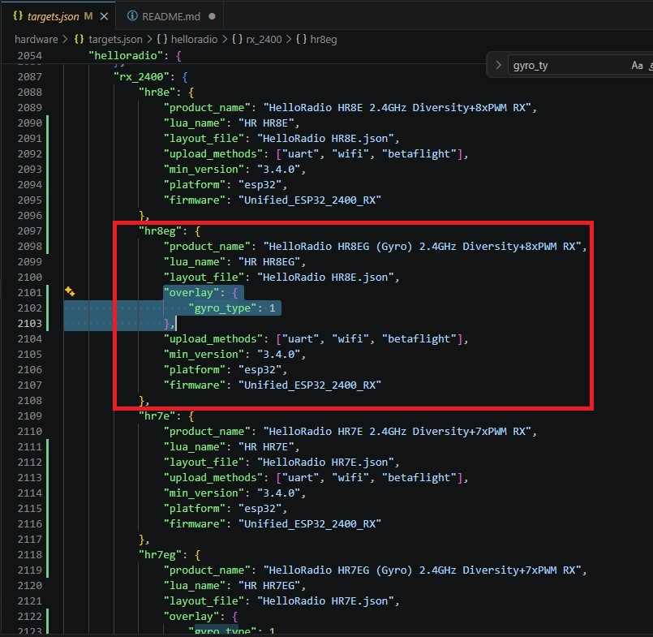
the "hr8e" is the original target, and we copy it to create "hr8g".  Note the the Name and LUA name algo changed.

You can download my copy of the targets.json who has the HR7EG,HR8EG and the SuperP + Gyro. Also added ER8+DIY Gyro recently where the Ch7-8 are used to connect the MPU6050 external gyro.

[hardware/targets.json](hardware/targets.json)

If you have Radiomaster ER6/ER8, you can just create a copy and add the gyro_type, also in the overlay you can set changes needed for PWM and I2C pins.

For the ones using the LSM6DSO chip, you can download the file needed from here for some common RXs from my "gyro-doc/hardware/RX" folder.  The files will go into your "src/hardware/RX" folder.

After this, your new RX should show in the targets of the ELRS configurator.